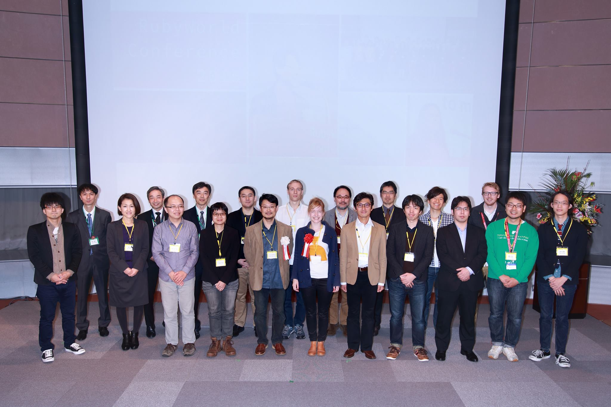
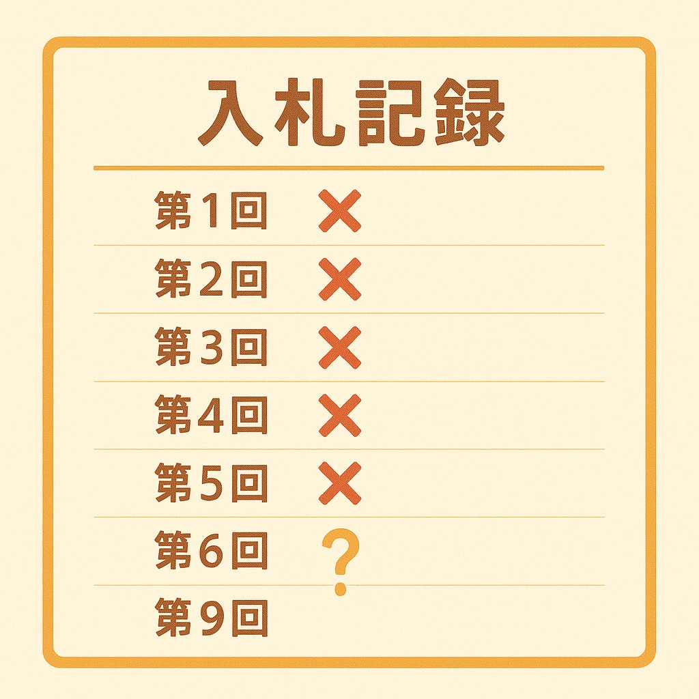

<!-- _class: lead scale-95 -->
<!-- _paginate: false -->

# コードのように台湾語を解析
## Rubyによる白話字ローマ字の3段階解析

**鄧慕凡 (Mu-Fan Teng)**

RubyWorld Conference 2025
Nov. 7, 2025
島根県立産業交流会館「くにびきメッセ」

<!--
Speaker Note:
みなさん、こんにちは。5xRubyのCEO、鄧慕凡と申します。
本日は「コードのように台湾語を解析：Rubyによる白話字ローマ字の3段階解析」というテーマで発表させていただきます。
これから15分間、台湾語の文字解析という一見難しそうな問題を、Rubyを使ってどのように解決したかをお話しします。
-->

---

<!-- _class: center scale-95 -->

# 自己紹介

**鄧慕凡 (Mu-Fan Teng) 
- 日本では竜堂 終と呼ばれています
- 5xRuby CO., LTD 創業者
- 台湾のRuby伝道師
- RubyConf Taiwan Chief Organizer


<!--
Speaker Note:
まず簡単に自己紹介させてください。
私は台湾の5xRubyという会社のCEOで、2011年からRubyコミュニティで活動しています。
毎年RubyConf Taiwanを主催しており、Ruby普及活動を続けています。

そして、今年2025年1月に、島根県松江市とMOUを締結しました！
松江市はRubyの生まれ故郷であり、このご縁に大変感謝しております。
今回のRubyWorld Conferenceでは、Rubyコミュニティのブースも出展しておりますので、
ぜひお立ち寄りください。
-->

---

<!-- _class: scale-75 -->

# RubyCity 縁結びの地との10年の物語

<div style="width: 90%; margin: 1.5em auto;">

<!-- 上半部：卡片與照片 -->
<div style="display: grid; grid-template-columns: 1fr 1fr 1fr 1fr; gap: 0.5em; margin-bottom: 1em;">

  <!-- 2015 事件卡片 -->
  <div style="display: flex; flex-direction: column; align-items: center; justify-content: flex-end;">
    <div style="background: linear-gradient(135deg, #fff 0%, #fafafa 100%); padding: 0.6em; border-radius: 8px; border: 2px solid #CC342D; box-shadow: 0 2px 8px rgba(0,0,0,0.1);">
      <div style="color: #CC342D; font-weight: bold; margin-bottom: 0.3em; font-size: 0.8em;">🌸 縁の始まり</div>
      <ul style="font-size: 0.65em; line-height: 1.2; margin: 0; padding-left: 2em; text-align: left;">
        <li>初めてRWCの講者として登壇</li>
        <li>RubyCity Matsueとの出会い</li>
      </ul>
    </div>
    <div style="margin: 1em 0; font-size: 1.1em; font-weight: bold; color: #CC342D;">2015</div>
    <div style="width: 3px; height: 1em; background: #CC342D;"></div>
  </div>

  <!-- 2023 照片 -->
  <div style="display: flex; flex-direction: column; align-items: center; justify-content: flex-end;">
    
  </div>

  <!-- 2024 事件卡片 -->
  <div style="display: flex; flex-direction: column; align-items: center; justify-content: flex-end;">
    <div style="background: linear-gradient(135deg, #fff 0%, #fafafa 100%); padding: 0.6em; border-radius: 8px; border: 2px solid #CC342D; box-shadow: 0 2px 8px rgba(0,0,0,0.1);">
      <div style="color: #CC342D; font-weight: bold; margin-bottom: 0.3em; font-size: 0.8em;">🤝 縁の深化</div>
      <ul style="font-size: 0.65em; line-height: 1.2; margin: 0; padding-left: 2em; text-align: left;">
        <li>上定昭仁市長の5xRuby訪問</li>
        <li>RubyCityとの絆が深まる</li>
      </ul>
    </div>
    <div style="margin: 1em 0; font-size: 1.1em; font-weight: bold; color: #CC342D;">2024</div>
    <div style="width: 3px; height: 1em; background: #CC342D;"></div>
  </div>

  <!-- 2025 照片 -->
  <div style="display: flex; flex-direction: column; align-items: center; justify-content: flex-end;">
    
  </div>

</div>

<!-- 時間軸線 -->
<div style="position: relative; height: 8px; background: #CC342D; border-radius: 4px; margin: 0;">

  <!-- 2015 標記點 -->
  <div style="position: absolute; left: 12.5%; top: 50%; transform: translate(-50%, -50%);">
    <div style="width: 20px; height: 20px; background: #CC342D; border: 4px solid white; border-radius: 50%; box-shadow: 0 0 0 2px #CC342D; position: relative; z-index: 10;"></div>
  </div>

  <!-- 2023 標記點 -->
  <div style="position: absolute; left: 37.5%; top: 50%; transform: translate(-50%, -50%);">
    <div style="width: 20px; height: 20px; background: #CC342D; border: 4px solid white; border-radius: 50%; box-shadow: 0 0 0 2px #CC342D; position: relative; z-index: 10;"></div>
  </div>

  <!-- 2024 標記點 -->
  <div style="position: absolute; left: 62.5%; top: 50%; transform: translate(-50%, -50%);">
    <div style="width: 20px; height: 20px; background: #CC342D; border: 4px solid white; border-radius: 50%; box-shadow: 0 0 0 2px #CC342D; position: relative; z-index: 10;"></div>
  </div>

  <!-- 2025 標記點 -->
  <div style="position: absolute; left: 87.5%; top: 50%; transform: translate(-50%, -50%);">
    <div style="width: 20px; height: 20px; background: #CC342D; border: 4px solid white; border-radius: 50%; box-shadow: 0 0 0 2px #CC342D; position: relative; z-index: 10;"></div>
  </div>

</div>

<!-- 下半部：照片與卡片 -->
<div style="display: grid; grid-template-columns: 1fr 1fr 1fr 1fr; gap: 0.5em; margin-top: 1em;">

  <!-- 2015 照片 -->
  <div style="display: flex; flex-direction: column; align-items: center; justify-content: flex-start;">
    <div style="width: 0px; height: 1em; background: #CC342D; margin-bottom: 1em;"></div>
    
  </div>

  <!-- 2023 事件卡片 -->
  <div style="display: flex; flex-direction: column; align-items: center; justify-content: flex-start;">
    <div style="width: 3px; height: 1em; background: #CC342D;"></div>
    <div style="margin: 1em 0; font-size: 1.1em; font-weight: bold; color: #CC342D;">2023</div>
    <div style="background: linear-gradient(135deg, #fff 0%, #fafafa 100%); padding: 0.6em; border-radius: 8px; border: 2px solid #CC342D; box-shadow: 0 2px 8px rgba(0,0,0,0.1);">
      <div style="color: #CC342D; font-weight: bold; margin-bottom: 0.3em; font-size: 0.8em;">💝 縁結びの実現</div>
      <ul style="font-size: 0.65em; line-height: 1.2; margin: 0; padding-left: 2em; text-align: left;">
        <li>RubyCityからの協携提案</li>
        <li>市長と市役所で会談</li>
        <li>再びRWCの壇上へ</li>
      </ul>
    </div>
  </div>

  <!-- 2024 照片 -->
  <div style="display: flex; flex-direction: column; align-items: center; justify-content: flex-start;">
    <div style="width: 0px; height: 1em; background: #CC342D; margin-bottom: 1em;"></div>
    
  </div>

  <!-- 2025 事件卡片 -->
  <div style="display: flex; flex-direction: column; align-items: center; justify-content: flex-start;">
    <div style="width: 3px; height: 1em; background: #CC342D;"></div>
    <div style="margin: 1em 0; font-size: 1.1em; font-weight: bold; color: #CC342D;">2025</div>
    <div style="background: linear-gradient(135deg, #fff 0%, #fafafa 100%); padding: 0.6em; border-radius: 8px; border: 2px solid #CC342D; box-shadow: 0 2px 8px rgba(0,0,0,0.1);">
      <div style="color: #CC342D; font-weight: bold; margin-bottom: 0.3em; font-size: 0.8em;">💍 縁結びの証</div>
      <ul style="font-size: 0.65em; line-height: 1.2; margin: 0; padding-left: 2em; text-align: left;">
        <li>RubyConf Taiwan × COSCUP 2025 <BR/>で覚書締結</li>
        <li>RubyCityとの正式な絆</li>
      </ul>
    </div>
  </div>

</div>

</div>

<!--
Speaker Note:
私と松江市の縁についてお話しさせてください。

2015年、私は初めてRubyWorld Conferenceの講者として、この松江市を訪れました。
Ruby誕生の地で講演できたことは、大変光栄でした。
それから8年の時を経て...

2023年、私は再びRWCに登壇する機会をいただきました。
その際、松江市から台湾のRubyコミュニティとの正式な協力関係を提案されました。
上定昭仁市長と直接お話しする機会もあり、具体的な協力の方向性を議論しました。

2024年2月2日、市長が一行を率いて台北の5xRubyを訪問してくださいました。
技術と文化を超えた、深い交流となりました。

そして今年、2025年1月8日、RubyConf TaiwanとCOSCUPの会場で、
正式にMOUを締結しました。
市長もTwitterで、この歴史的な瞬間をシェアしてくださいました。

これは単なるビジネスの提携ではありません。
Rubyを愛する者同士が、10年という時間をかけて築いた、
深い絆の結晶なのです。

だからこそ、今回のRubyWorld Conference 2025で、
この場所で、皆さんの前で発表できることを、
心から光栄に思っています。
-->

---

<!-- _class: center -->

# 5xRubyについて

**「愛する技術で愛される製品を創る」**

- **創業**: 2014年（台北）
- **専門**: Ruby/Railsを中心としたソフトウェア開発
- **実績**: スタートアップ向けシステム開発を中心に、政府機関との協業案件も手がける

<!--
Speaker Note:
5xRubyは2014年に台北で創業したソフトウェア開発会社です。
私たちのビジョンは「愛する技術で愛される製品を創る」こと。
Rubyを中心とした技術スタックで、主にスタートアップ企業向けの
システム開発を手がけています。
政府機関の案件は、他社との協業という形で関わることが多いですが、
今回の台湾語語料庫プロジェクトは、私たちが直接入札して
受託した珍しいケースです。
-->

---

<!-- _class: scale-85 -->

# 5xRubyの事業

<div class="two-columns">

<div>

<div style="text-align: center;">


</div>

## 1. 委託開発サービス
- ソフトウェア開発・コンサルティング
- プロダクト検証・技術支援
- 柔軟なチーム編成で最適なソリューション提供

</div>

<div>

<div style="text-align: center;">


</div>

## 2. SOSI製品
- リモートアクセス管理システム
- セキュアな外部接続環境を提供
- 中小企業向けVDIソリューション

</div>

</div>

<!--
Speaker Note:
私たちは2つの柱で事業を展開しています。

1つ目は委託開発サービスです。クライアントのビジネスゴールを深く理解し、
実践的なソリューションを提供します。柔軟なチーム編成により、
プロジェクトの規模や要件に応じた最適な開発体制を構築します。

2つ目は自社製品のSOSIです。これはセキュアなリモートアクセス管理システムで、
企業の機密情報を守りながら、リモートワークを実現するVDIソリューションです。
ブラウザベースで利用でき、複雑な設定が不要なのが特徴です。
-->

---

<!-- _class: lead -->

# 第一幕：無人入札の物語

**なぜ誰も手を出さなかったのか？**

<!--
Speaker Note:
それでは本題に入ります。まずは、このプロジェクトがどのように始まったのか、
少し面白いエピソードからお話しします。
-->

---

<!-- _class: scale-95 -->

# 台湾政府案件の特殊性

<div class="three-columns">

<div>

<div style="text-align: center;">


</div>

### 技術の制約
- Microsoft製品への依存
- .NET/MS-SQL/Windows Server
- Ruby/Railsは落選しがち

</div>

<div>

<div style="text-align: center;">


</div>

### プロセスの問題
- RFP（要求仕様書）の不備
- 担当者の専門知識不足
- 実務との乖離

</div>

<div>

<div style="text-align: center;">


</div>

### 関係構築コスト
- 技術以上に「関係」が重要
- 本来の開発時間を圧迫

</div>

</div>

<!--
Speaker Note:
まず、台湾政府のIT案件には特殊な構造的課題があります。

1つ目は技術的制約です。政府機関はMicrosoft製品に強く依存しており、
RubyやRailsを使う私たちのような会社は、技術スタックの理由だけで落選することがよくあります。

2つ目は、プロセスの問題です。要求仕様書が不十分だったり、
担当者や評価委員が技術の専門知識を持っていないため、適切な評価が難しい状況があります。

3つ目は、関係構築のコストです。落札には技術力以上に「関係」が重要で、
本来ソフトウェア開発に使うべき時間を、営業活動に費やさなければなりません。

このような環境で、私たちは何度も挑戦を続けてきました。
-->

---

<!-- _class: scale-90 -->

# 8連敗からの学び

<div class="two-columns">

<div>

<div style="text-align: center;">



</div>

## 落選の理由（技術以外）
- Microsoft製品前提の仕様
- 既存システムとの「互換性要求」
- 評価基準の不透明さ
- 価格競争ではなく、技術スタックの制約

</div>

<div>

<div style="text-align: center;">


</div>

## 9回目：驚きの展開
- **競合：ゼロ**
- 「なぜ誰も入札しないのか？」
- 担当者も困惑：「本当に大丈夫ですか？」
- **一体何が起こったのか？**

</div>

</div>

<!--
Speaker Note:
私たちは8回連続で落札に失敗しました。その理由は価格ではありませんでした。

多くの場合、仕様がMicrosoft製品を前提としていたり、
既存システムとの「互換性」という名目で、実質的に特定の技術スタックに縛られていました。

しかし、9回目の入札で驚くべきことが起こりました。
競合がゼロ。つまり、私たち以外誰も入札しなかったのです。

政府の担当者も困惑して、「本当に大丈夫ですか？受託できますか？」と何度も確認されました。

一体何が起こったのでしょうか？その理由は、落札後に明らかになります。
-->

---

<!-- _class: center highlight -->

# 落札後の真相

**「分詞（文字分割）が煩雑すぎて**
**誰も手を出さない」**

<!--
落札してから、その理由が分かりました。
この案件の核心は「台湾語の分詞処理」。
つまり、台湾語の文章を単語ごとに分割する作業です。

業界の人たちは、これがどれだけ複雑で面倒な作業か知っていたのです。
だから誰も入札しなかった。

でも、私たちはその複雑さを理解していませんでした。
ある意味、無知が勇気だったのかもしれません。

そして、実際に取り組んでみて分かったのは、
これは確かに難しい問題だが、Rubyを使えば解決できる、ということでした。
-->

---

<!-- _class: lead -->

# 第二幕：台羅拼音（POJ）とは？

**日本語との類似性から理解する**

<!--
Speaker Note:
では、何がそんなに難しいのか？
まず台湾語の文字システムについて説明します。
日本語と比較すると理解しやすいと思います。
-->

---

<!-- _class: scale-85 -->

# 台羅拼音とは？

| 前後文脈（漢字） | 前後文脈（POJ） |
|------------------|------------------|
| 去**日本**食壽司 | khì **Ji̍t-pún** tsia̍h sú-sih |
| 香港、澳門...、臺灣佮**日本** | Hiong-káng, Ò-mn̂g...Tâi-uân kah **Ji̍t-pún** |
| 的時，**日本**義工共臺灣人 | ê sî, **Ji̍t-pún** gī-kang kā Tâi-uân-lâng |

<div class="two-columns">

<div>

## 台湾語のローマ字表記
- **正式名称**: 臺灣台語羅馬字拼音方案
- **略称**: 台羅 (Tâi-lô)
- **制定**: 2006年10月、台湾教育部公布
- **地位**: 台湾語の公式表記システム

</div>

<div>

## 中国語（北京語）ではない
- **台湾語**: 閩南語系の言語
- **特徴**:
  - 9つの声調
  - 独自の子音・母音体系
  - 鼻音化の表記 (nn)
- **歴史**: 白話字 (POJ) をベースに IPA 要素を取り入れて開発

</div>

</div>

<!--
Speaker Note:
まず、台羅拼音について説明します。

台羅拼音は、2006年に台湾の教育部が公布した、台湾語の公式ローマ字表記システムです。
正式名称は「臺灣台語羅馬字拼音方案」で、略して「台羅」と呼ばれています。

ここで重要なのは、台湾語は中国語（北京語）とは異なる言語だということです。
台湾語は閩南語系の言語で、9つの声調を持ち、独自の子音・母音体系があります。

この台羅拼音は、19世紀から使われてきた白話字（POJ）をベースに、
国際音声記号（IPA）の要素を取り入れて開発されました。

つまり、私たちが扱っているのは、一般的な「中国語のピンイン」ではなく、
台湾固有の言語を表記するための、独自のローマ字システムなのです。

そして、この表で見ていただきたいのは、実際の語料庫での「日本」という言葉の使われ方です。
どの文脈でも、「日本」という漢字は必ず「Ji̍t-pún」というPOJと対応しています。
これは、日本語の振り仮名のように、漢字とPOJが一対一で対応する様子を示しています。
-->

---

<!-- _class: scale-80 -->

# 日本語と台湾語の文字システム

<div class="two-columns">

<div>

## 日本語
- **漢字** ↔ **ひらがな/カタカナ**
- 例：
  - 「生」→ せい/しょう/なま/い...
  - 「音読み」と「訓読み」
  - 文脈によって読み方が変わる

</div>

<div>

## 台湾語
- **漢字** ↔ **POJ（白話字）**
- 例：
  - 「夫」→ hu
  - 「膚」→ hu (同音異字)
- **共通点**: 同音異字が存在
- **相違点**: 本システムでは文章内で漢字とPOJの完全一致が必須

</div>

</div>

<!--
Speaker Note:
日本語では、漢字は音読みと訓読みがあり、文脈によって読み方が変わります。
「生」という漢字は、「せい」「しょう」「なま」「いきる」など、様々な読み方があります。

台湾語も同様に、同音異字の現象があります。
例えば「夫」も「膚」もどちらも「hu」と読みます。

しかし、本システムの重要な特徴は、語料庫の各文章において、
漢字とPOJが完全に一致しなければならないという点です。

つまり、「夫」と書かれた文章には「hu」が対応し、
「膚」と書かれた文章にも「hu」が対応しますが、
それぞれの文章内では一対一の対応が厳密に要求されます。

この完全一致の要件が、分詞処理を複雑にしている理由の一つです。
-->

---

<!-- _class: scale-80 -->

# 実際の分詞アライメント処理例

<div style="background: #f5f5f5; padding: 1.5em; border-radius: 8px; margin: 1em 0;">

**入力データ（拆字前）:**
- 漢字：`紲落來看新竹市明仔載二十六號的天氣`
- 白話字：`suà-lo̍h lâi-khuànn Sin-tik-tshī bîn-á-tsài gī-tsap-lak hō ê thinn-khì`

**期待される出力（分詞アライメント処理後）:**

| 漢字 | 白話字 |
|------|--------|
| 紲落 | suà-lo̍h |
| 來看 | lâi-khuànn |
| 新竹市 | Sin-tik-tshī |
| 明仔載 | bîn-á-tsài |
| 二十六 | gī-tsap-lak |
| 號 | hō |
| 的 | ê |
| 天氣 | thinn-khì |

</div>

<!--
Speaker Note:
実際の例を見てみましょう。

上段は拆字前のデータです。漢字の文章と、それに対応するPOJ（台羅拼音）が
スペース区切りで並んでいます。

下段が期待される出力です。漢字とPOJを単語ごとに分割し、
それぞれが完全に対応するように配列化する必要があります。

「紲落」と「suà-lo̍h」、「來看」と「lâi-khuànn」、
このように各単語が正確に対応しなければなりません。

一見簡単そうですが、これには多くの技術的課題があります。
-->

---

<!-- _class: lead -->

# 第三幕：分詞アライメント処理の実装

**65+ パターンルールと4段階処理フロー**

<!--
Speaker Note:
それでは、これらの課題にどのように解決したのか、
実際の実装方法をお見せします。
-->

---

<!-- _class: scale-70 -->

# パターンルールの体系化

<div class="four-columns">

<div>

## 引用符（8件）

```ruby
# スマート引用符
/''/ => "'"

# 前後分離
/(.)('')(.)/ => '\1 \2 \3'
/(.)(")(.)/ => '\1 \2 \3'

# 行頭・行末
/^"/ => '" '
/"$/ => ' "'
```

</div>

<div>

## 括弧（6件）

```ruby
# 全角括弧
/（([^（]+)/ => ' （ \1'
/([^）]+)）/ => '\1 ） '

# 英数字最適化
/\(\s([a-z0-9]+)\s\)/
  => '(\1)'
```

</div>

<div>

## 省略記号（7件）

```ruby
# 3点リーダー
/\s\.\s\.\s\.$/
  => ' ...'
'. ..' => '...'

# 台湾式省略
/(‧‧‧)([^‧])/
  => '\1 \2'
```

</div>

<div>

## 句読点（10+件）

```ruby
# カンマ・ピリオド
/(.)(,)(.)/ => '\1 \2 \3'
/([^\.])(\.)/ => '\1 \2'

# 長音符
'─' => ' ─ '

# コロン
/(.)(:)(.)/ => '\1 \2 \3'
```

</div>

</div>

**合計: 65+ パターン規則を体系化**

<!--
Speaker Note:
拆字の核心は、65以上の変換パターンを定義したハッシュです。
これらは大きく4つのカテゴリーに分けられます。

1つ目は引用符の処理です。8種類のパターン。
スマート引用符の正規化、引用符前後の分離、行頭行末の処理など。

2つ目は括弧の処理です。6種類のパターン。
全角括弧と半角括弧の前後分離処理。
特に英数字を含む括弧は最適化処理を行います。

3つ目は省略記号です。7種類のパターン。
ピリオド3つの省略記号と、台湾特有の中黒を使った省略記号、
両方に対応する必要がありました。

4つ目は句読点の処理です。10種類以上のパターン。
カンマ、ピリオド、コロン、長音符など、
様々な句読点を前後のテキストから分離します。

これらのパターンを順番に適用することで、
複雑な記号が混在したテキストを正しく処理できるようになりました。
-->

---

<!-- _class: scale-80 -->

# 実装の全体フロー：Step 1 - 漢字拆分処理

**処理の流れ:** 漢字文本 → 記号正規化 → CJK文字スキャン → 特殊組合処理 → kanji_array

<div class="three-columns">

<div>

## Step 1-2: 正規化とスキャン

```ruby
# Step 1: 記号正規化
kanji = "紲落來看新竹市明仔載。"
normalized = apply_kanji_patterns(kanji)
# => "紲落來看新竹市明仔載 。"

# Step 2: CJK文字をスキャン
RXP_SPK = /[\p{Han}\p{Katakana}
  \p{Hiragana}\p{Hangul}
  \u3000-\u303F\uFF00-\uFFEF]|
  [^\p{Han}\p{Katakana}
  \p{Hiragana}\p{Hangul}
  \u3000-\u303F\uFF00-\uFFEF]+/x

tokens = normalized.scan(RXP_SPK)
```

</div>

<div>

## RXP_SPK が識別する文字

**Unicode文字プロパティ:**

- **\p{Han}**
  漢字（中日韓）

- **\p{Katakana}**
  日本語カタカナ

- **\p{Hiragana}**
  日本語ひらがな

- **\p{Hangul}**
  韓国語ハングル

- **\u3000-\u303F**
  CJK記号・句読点

- **\uFF00-\uFFEF**
  全角ASCII・半角カタカナ

</div>

<div>

## Step 3: 特殊組合せと結果

```ruby
# Step 3: 特殊組合せを処理
combined = combine_special_pairs(tokens)

# 例: 一緒に扱うべき記号
# "……" + "。" => "……。"
# "』" + "。" => "』。"
# "——" + 文字 => "——" + 文字

# 最終結果
kanji_array = combined.split
# => ["紲落", "來看", "新竹市",
#     "明仔載", "。"]
```

**ポイント:**
- 多言語混在に対応
- Unicode標準に基づく
- 記号の前後処理で分割準備

</div>

</div>

<!--
Speaker Note:
それでは、実際の実装フローを4つのステップに分けて詳しく見ていきましょう。

【Step 1: 漢字拆分処理】

まず、漢字側の処理を見てみましょう。
処理の流れは非常にシンプルです。

入力は、漢字の文章です。
例えば「紲落來看新竹市明仔載。」という文章があります。

ステップ1は、記号正規化です。
KANJI_GSUB_PATTERNS を適用して、
記号の前後にスペースを挿入します。

例えば、句点「。」の前にスペースが挿入されて、
「紲落來看新竹市明仔載 。」となります。

これにより、後の処理で句点を独立したトークンとして扱えるようになります。

ステップ2は、CJK文字のスキャンです。
ここで重要なのが、RXP_SPK という正規表現です。

画面に表示されているように、この正規表現は6種類の文字を識別します。

1つ目は、\p{Han}、つまり漢字です。
中国語、日本語、韓国語の漢字をすべてカバーします。

2つ目と3つ目は、日本語のカタカナとひらがなです。
台湾語のテキストには、日本語が混在することがよくあるからです。

4つ目は、韓国語のハングルです。

5つ目と6つ目は、CJK記号・句読点と、全角ASCII・半角カタカナです。

このように、Unicode文字プロパティを使うことで、
多言語が混在したテキストを正確に識別できます。

ステップ3は、特殊組合せの処理です。
省略記号「……」と句点「。」のように、
一緒に扱うべき記号の組み合わせを処理します。

最終結果として、kanji_array が得られます。
この例では、["紲落", "來看", "新竹市", "明仔載", "。"]
という配列になります。

各単語が正しく分割され、次のステップで
POJとの対応付けができる状態になりました。
-->

---

<!-- _class: scale-80 -->

# 実装の全体フロー：Step 2 - POJ拆分処理

**処理の流れ:** POJ文本 → 記号正規化 → スペース分割 → roman_array

<div class="three-columns">

<div>

## Step 1: 記号正規化

```ruby
# ROMAN_GSUB_PATTERNS の適用
roman = "suà-lo̍h lâi-khuànn,Sin-tik-tshī"
normalized = apply_roman_patterns(roman)
# => "suà-lo̍h lâi-khuànn , Sin-tik-tshī"

# 65+ パターンで正規化:
# - 引用符の前後にスペース
# - カンマ・ピリオドの分離
# - 括弧の前後処理
# - 声調記号の正規化
# - ハイフンの保持（重要！）
```

**ポイント:**
- ハイフンは**保持**
- 記号を分離してスペース挿入
- Unicode声調記号を正規化

</div>

<div>

## Step 2: スペース分割

```ruby
# Roman側は非常にシンプル
def splitted_roman
  washed_roman
    .split(/\s/)
    .compact_blank
end

# 例:
"suà-lo̍h lâi-khuànn , Sin-tik-tshī"
  .split(/\s/)
# => ["suà-lo̍h",
#     "lâi-khuànn",
#     ",",
#     "Sin-tik-tshī"]
```

**重要な設計:**
- **ハイフンでは分割しない**
- **スペースのみで分割**
- 単語内の音節構造を保持

</div>

<div>

## 最終結果と特徴

```ruby
# roman_array の生成
roman_array = splitted_roman
# => ["suà-lo̍h",
#     "lâi-khuànn",
#     ",",
#     "Sin-tik-tshī"]
```

**POJ側の特徴:**

- ✅ **シンプル**: 2ステップのみ
- ✅ **予測可能**: スペースで分割
- ✅ **音節保持**: ハイフンを保持
- ✅ **記号分離**: 独立トークン化

**Kanji側との違い:**
- CJK文字スキャン不要
- 特殊組合せ処理不要
- 分割ルールが明確

</div>

</div>

<!--
Speaker Note:
【Step 2: POJ拆分処理】

次は、POJ側の拆分処理を見ていきましょう。
実は、POJ側の処理は漢字側と比べて非常にシンプルです。

【Step 1: 記号正規化】

まず第一歩は、記号の正規化です。

入力例を見てみましょう。
「suà-lo̍h lâi-khuànn,Sin-tik-tshī」というPOJテキストがあります。

注目してほしいのは、カンマの後にスペースがないことです。
また、「lâi-khuànn」と「Sin-tik-tshī」の間にはハイフンがあります。

ROMAN_GSUB_PATTERNS を適用すると、
「suà-lo̍h lâi-khuànn , Sin-tik-tshī」となります。

カンマの前後にスペースが挿入されました。

このパターンハッシュには、65以上のパターンが定義されています：
- 引用符の前後にスペース挿入
- カンマ・ピリオドの分離
- 括弧の前後処理
- Unicode声調記号の正規化
- そして最も重要なのは、ハイフンの保持です！

単語内のハイフンは削除せず、そのまま保持します。
なぜなら、最終的な分割は「スペース」で行うからです。

【Step 2: スペース分割】

第二歩は、非常にシンプルです。

splitted_roman メソッドは、わずか3行です：

washed_romanで正規化されたテキストを、
スペース（\s）で分割し、
compact_blankで空要素を削除するだけです。

実行結果を見てみましょう：
「suà-lo̍h lâi-khuànn , Sin-tik-tshī」
を split(/\s/) で分割すると、

["suà-lo̍h", "lâi-khuànn", ",", "Sin-tik-tshī"]

という配列が得られます。

ここで重要なポイントは：
**ハイフンでは分割しない**
**スペースのみで分割する**

ということです。

単語内の音節構造を表すハイフンは保持されます。
「suà-lo̍h」は1つのトークンとして扱われます。

【POJ側の特徴】

POJ側の処理には4つの大きな特徴があります：

1つ目は、シンプルさです。
わずか2ステップで完了します。

2つ目は、予測可能性です。
スペースで分割するという単純なルールです。

3つ目は、音節構造の保持です。
ハイフンを保持することで、単語内の音節関係を維持します。

4つ目は、記号の分離です。
カンマやピリオドは独立したトークンになります。

【Kanji側との違い】

最後に、漢字側との違いを強調しておきます：

POJ側には、CJK文字のスキャンは不要です。
特殊な組み合わせ処理も不要です。
分割ルールが非常に明確で、シンプルです。

これは、POJがラテン文字ベースであり、
スペースという明確な区切り文字があるからです。

一方、漢字はスペースなしで連続するため、
より複雑な処理が必要になるのです。

この対比が、次のステップでの対応付け処理を理解する上で重要になります。
-->

---

<!-- _class: scale-80 -->

# 実装の全体フロー：Step 3 - 配對邏輯（アライメント）

**処理の流れ:** roman_array + kanji_array → ハイフン数で対応付け → 配対陣列

<div class="three-columns">

<div>

## 基本原理：音節数の一致

```ruby
# POJ側
"suà-lo̍h"
  .split('-')
  # => ["suà", "lo̍h"]
  # 2音節

# 漢字側
"紲落"
  .split('-')
  # => ["紲落"]
  # 1トークン（ハイフンなし）
```

**問題:**
- POJ: 2音節
- 漢字: 1トークン
- **一致しない!**

</div>

<div>

## 解決策：複数結合

```ruby
# Step 1: POJの音節数をカウント
roman_syllables = 2

# Step 2: 漢字側を累積
kanji_tokens = ["紲", "落"]
combined = "紲" # 1トークン
total = 1

# Step 3: 足りない分を追加
while total < roman_syllables
  combined += kanji_tokens.shift
  total += 1
end

# 結果
combined # => "紲落"
```

**対応関係:**
- `"suà-lo̍h"` ↔ `"紲落"`

</div>

<div>

## 実際の処理例

```ruby
# 入力配列
roman_array = [
  "suà-lo̍h",    # 2音節
  "lâi-khuànn",  # 2音節
  "Sin-tik-tshī" # 3音節
]

kanji_array = [
  "紲", "落", "來", "看",
  "新", "竹", "市"
]
```

**処理結果:**
```ruby
[
  ["suà-lo̍h", "紲落"],
  ["lâi-khuànn", "來看"],
  ["Sin-tik-tshī", "新竹市"]
]
```

</div>

</div>

<!--
Speaker Note:
【Step 3: 配對邏輯（アライメント）】

さて、いよいよ最も重要なステップ、対応付け処理です。
ここでは、一般的なケースのみに焦点を当てます。

【基本原理：音節数の一致】

左側のカラムを見てください。
基本的な問題を示しています。

POJ側では、「suà-lo̍h」という単語があります。
ハイフンで分割すると、「suà」と「lo̍h」の2音節です。

一方、漢字側では「紲落」という2文字があります。
しかし、これはハイフンがないので、1つのトークンとして扱われます。

ここに問題があります：
POJは2音節、漢字は1トークン。
数が一致しません！

【解決策：複数結合】

中央のカラムでは、この問題の解決策を示しています。

ステップ1：POJの音節数をカウントします。
この場合、2音節です。

ステップ2：漢字側のトークンを累積していきます。
最初に「紲」を取り出します。これで1トークンです。

ステップ3：音節数が足りないので、
whileループで次のトークン「落」を追加します。
これで2トークンになり、音節数と一致します。

結果として、「紲落」という結合されたトークンができます。

これで、「suà-lo̍h」と「紲落」が対応関係になりました。

【実際の処理例】

右側のカラムでは、実際の処理例を見てみましょう。

入力として、3つのPOJ単語があります：
1. 「suà-lo̍h」（2音節）
2. 「lâi-khuànn」（2音節）
3. 「Sin-tik-tshī」（3音節）

漢字側には、7つのトークンがあります：
紲、落、來、看、新、竹、市

対応付けプロセスを見てみましょう：

1つ目：「suà-lo̍h」は2音節なので、
「紲」と「落」を結合して「紲落」にします。

2つ目：「lâi-khuànn」も2音節なので、
「來」と「看」を結合して「來看」にします。

3つ目：「Sin-tik-tshī」は3音節なので、
「新」と「竹」と「市」を結合して「新竹市」にします。

最終結果として、3つのペアの配列ができます。

このように、音節数を基準に、
漢字トークンを動的に結合していくことで、
POJと漢字の完全な対応関係を構築できるのです。

この方法は非常にシンプルですが、効果的です。
音節という言語学的な単位を基準にすることで、
複雑な対応関係も自然に解決できます。
-->

---

<!-- _class: scale-80 -->

# 実装の全体フロー：Step 4 - 配列構築と検証

**処理の流れ:** 配対陣列 → Transpose → 2つの配列 → 平衡性検証

<div class="three-columns">

<div>

## Step 1: Transpose操作

```ruby
# 入力：配対陣列
pairs = [
  ["suà-lo̍h", "紲落"],
  ["lâi-khuànn", "來看"],
  ["Sin-tik-tshī", "新竹市"]
]

# Transposeで分離
transposed = pairs.transpose
# => [
#   ["suà-lo̍h", "lâi-khuànn", "Sin-tik-tshī"],
#   ["紲落", "來看", "新竹市"]
# ]

# 配列に設定
roman_array = transposed[0]
kanji_array = transposed[1]
```
</div>

<div>

## Step 2: 平衡性検証

```ruby
# 3つの条件をチェック
balanced = [
  # 条件1: 空でない = 処理が成功している
  roman_array.size > 0,

  # 条件2: サイズ一致 = 1:1対応が保たれている
  roman_array.size == kanji_array.size,

  # 条件3: 文字数一致 = 漢字が欠落していない = 重複もしていない
  kanji_array.join.size ==
    original_kanji.delete(' ').size
].all?
```

</div>

<div>

## 検証の具体例

```ruby
roman_array.size # => 3
kanji_array.size # => 3
# ✅ サイズ一致

kanji_array.join.size # => 7
original.size # => 7
# ✅ 文字数一致

arrays_balanced = true
```

</div>

</div>

<!--
Speaker Note:
【Step 4: 配列構築と検証】

最後のステップは、配列の構築と平衡性の検証です。

【Step 1: Transpose操作】

左側のカラムを見てください。

前のステップで得られた配対陣列があります：
[["suà-lo̍h", "紲落"], ["lâi-khuànn", "來看"], ["Sin-tik-tshī", "新竹市"]]

これは、[POJ, 漢字] のペアの配列です。

ここで、Rubyの transpose メソッドを使います。

transposeは、行列の転置操作を行います。
つまり、行と列を入れ替えるのです。

実行すると、
[["suà-lo̍h", "lâi-khuànn", "Sin-tik-tshī"],
 ["紲落", "來看", "新竹市"]]
という2つの配列に分離されます。

最初の配列が roman_array、
2つ目の配列が kanji_array になります。

このように、transposeメソッドを使うことで、
ペアの配列から、2つの独立した配列を簡単に取り出せます。

これは非常にRubyらしい、エレガントな方法です。

【Step 2: 平衡性検証】

中央のカラムでは、平衡性の検証について説明します。

平衡性とは、対応付けが正しく行われたかどうかを確認する指標です。

3つの条件をチェックします：

1つ目は、配列が空でないこと。
roman_array のサイズが 0 より大きいことを確認します。
もし空なら、処理が失敗しています。

2つ目は、サイズの一致です。
roman_array と kanji_array のサイズが同じでなければなりません。
一対一対応が保たれているはずなので、サイズは必ず一致します。

3つ目は、文字数の一致です。
kanji_array を結合した文字列のサイズが、
元の kanji テキストからスペースを削除したサイズと一致するか確認します。

これにより、漢字が欠落したり重複したりしていないことを保証できます。

これら3つの条件がすべて満たされた場合のみ、
arrays_balanced フラグを true に設定します。

【検証の具体例】

右側のカラムでは、具体的な検証例を見てみましょう。

入力データとして、「紲落來看新竹市」という7文字の漢字があります。

処理後、kanji_array は ["紲落", "來看", "新竹市"] の3要素、
roman_array も ["suà-lo̍h", "lâi-khuànn", "Sin-tik-tshī"] の3要素です。

検証を実行します：

まず、サイズをチェックします。
roman_array.size は 3、kanji_array.size も 3。
✅ サイズ一致！

次に、文字数をチェックします。
kanji_array を結合すると「紲落來看新竹市」、7文字です。
元の kanji からスペースを削除したサイズも7文字です。
✅ 文字数一致！

すべての条件を満たしているので、
arrays_balanced を true に設定します。

これで、完全な一対一対応が保証されました。
データの完全性が確認でき、次の処理へ進めます。

このように、transposeと平衡性検証を組み合わせることで、
正確で信頼性の高いデータ処理を実現できるのです。
-->

---

<!-- _class: lead -->

# 第四幕：Parserとの出会い

**2024年の実装から2025年の気づきへ**

<!--
Speaker Note:
2024年初頭、私たちは台羅拼音の拆字システムを完成させました。
40以上のGSUBパターン、音節数による対応付け、バランスチェック。
これらはすべて、実務の要求から生まれた実装でした。

そして2025年5月、物語は思わぬ展開を見せます。
-->

---

<!-- _class: center highlight -->

# Conference Driven Development

**Parser の方式で分詞アライメント処理を実装する**

<!--
Speaker Note:
実は、私は以前から Lrama Parser に関するトークを聞いていました。

2023年の RubyConf Taiwan では、
「Understanding Parser Generators surrounding Ruby with Contributing Lrama」

2025年の RubyKaigi では、
junk0612 さんの「Parser Generators and LR Parsing」

そして、2025年8月の RubyConf Taiwan x COSCUP 2025 で、
金子祐一郎さんの「Understanding Ruby Grammar Through Conflicts」を聞いて、
Parser の考え方に触れました。

この時、「私がやってきた分詞アライメント処理も、
Parser として実装できるのではないか？」と思いました。
-->

---

<!-- _class: scale-90 -->

# Kaneko さんのトークからの気づき

<div style="display: grid; grid-template-columns: 1.2fr 1fr; gap: 2em; align-items: center;">

<div>


</div>

<div>

**"Understanding Ruby Grammar Through Conflicts"**

<div style="margin: 1.5em 0; padding: 1em; background: #f5f5f5; border-left: 4px solid #CC342D; border-radius: 4px;">

**Parser の3段階処理**

1. **Lexical Analysis** (字句解析)
2. **Syntax Analysis** (構文解析)
3. **Semantic Analysis** (意味解析)

</div>

<div style="margin-top: 2em; padding: 1em; background: linear-gradient(135deg, #fff3cd 0%, #fff 100%); border-radius: 8px;">

<div style="text-align: center; font-size: 1.1em; margin-bottom: 0.8em;">
💡 **「私がやっていたのは... Parser だったのか！」**
</div>

<div style="text-align: center; font-size: 1.05em; margin-top: 1em; padding-top: 1em; border-top: 2px dashed #CC342D;">
→ **「Parser として実装し直してみよう」**
</div>

</div>

</div>

</div>

<!--
Speaker Note:
2025年5月、私は RubyConf x COSCUP Taiwan 2025 の CFP 審査をしていました。

その中に、Yuichiro Kaneko さんからの投稿がありました。
Kaneko さんは、Ruby 3.3 から導入された Lrama Parser の主要開発者です。

彼のトークタイトルは「Understanding Ruby Grammar Through Conflicts」。
Ruby の文法を、Parser の衝突（Conflict）を通じて理解する、という内容です。

投稿概要を読んでいるとき、ハッとしました。

Parser の 3 段階処理：
1. Lexical Analysis - テキストをトークンに分割
2. Syntax Analysis - トークン間の構造関係を構築
3. Semantic Analysis - 意味の検証とエラー検出

「あれ？これって... 私がやってきたことと似ているな」

40 個以上の GSUB パターンで記号を正規化し、
漢字と POJ を音節数で対応付けて、
最後に配列のバランスをチェックする。

これって、Parser の考え方に近いのではないか？

そう思ったとき、「もしかして、Parser として実装し直せるのでは？」
という好奇心が湧いてきました。

RubyWorld Conference 2025 の CFP が始まったとき、
この発見を共有したいと思い、投稿を決めました。

そして、投稿準備の中で、
「本当に Parser として実装できるのか？」を確かめてみたくなりました。

Parslet という PEG Parser ライブラリを使って、
実験的に実装してみることにしました。

これは production コードではなく、あくまで検証のための実験です。
でも、この実験を通じて、Parser の考え方が
自然言語処理にも応用できることを実感できました。
-->

---

<!-- _class: scale-85 -->

# Parslet gem との出会い

**Ruby で Parser を書くための DSL ライブラリ**

<div class="two-columns">

<div>

## なぜ Parslet？

- **PEG Parser**: Parsing Expression Grammar
- **Ruby DSL**: Ruby の文法で Parser を定義
- **明確な構造**: 3-phase 設計を自然に実現

```ruby
# Parslet の基本形
class MyParser < Parslet::Parser
  # Phase 1 & 2: 規則定義
  rule(:word) { match['a-z'].repeat(1) }
  rule(:sentence) { word >> space }

  root(:sentence)
end
```

</div>

<div>

## Parslet の設計思想

Parslet は開発者に **3つの Phase** を意識させる設計：

**Phase 1: Lexical Analysis**
- `rule()` で Token 型を定義
- `match[]`, `str()` で文字パターン

**Phase 2: Syntax Analysis**
- `>>`, `|` で規則を組み合わせ
- 自動的に AST を構築

**Phase 3: Semantic Analysis**
- `Transform` クラスで変換
- AST → 最終データ構造

</div>

</div>

<!--
Speaker Note:
Parser として実装してみようと思ったとき、
Ruby で Parser を書くための Gem を探しました。

そこで見つけたのが、Parslet です。

Parslet は、PEG Parser を Ruby の DSL で書けるライブラリです。

重要なのは、Parslet の設計思想です。

Parslet は、開発者に自然と 3 つの Phase を意識させる設計になっています。

Phase 1 では、rule() で Token の型を定義します。
Phase 2 では、規則を組み合わせて、自動的に AST が構築されます。
Phase 3 では、Transform クラスで、AST を最終的なデータ構造に変換します。

この構造が、まさに私が学んだ Parser の 3 段階処理と一致していました。
-->

---

<!-- _class: scale-75 -->

# Parslet DSL 基礎語法

<div class="three-columns">

<div>

## 基本構文

### `rule()` - 規則の定義

```ruby
rule(:letter) { match['a-zA-Z'] }
rule(:digit) { match['0-9'] }
```

**意味**: 再利用可能な Parser 規則を定義

### `match[]` - 文字クラス

```ruby
match['a-z']           # a-z
match['a-zA-Z0-9']     # 英数字
match['\u0300-\u036F'] # 声調記号
```

**意味**: 正規表現の `[...]` と同じ

### `str()` - 文字列マッチ

```ruby
str('-')      # ハイフン
str('--')     # 二重ハイフン
str(' - ')    # スペース-ハイフン-スペース
```

**意味**: 文字列の完全一致

</div>

<div>

## 組み合わせ

### `>>` - シーケンス

```ruby
# A の後に B が続く
rule(:word) { letter >> letter }
```

**意味**: 順序を持つ連結（AND）

### `|` - 選択

```ruby
# A または B（順序が重要！）
rule(:token) do
  double_hyphen_word |  # 先に試す
  hyphenated_word       # 後で試す
end
```

**重要**: PEG は最初にマッチした選択肢を採用

### `.repeat` - 繰り返し

```ruby
match['a-z'].repeat      # 0回以上
match['a-z'].repeat(1)   # 1回以上
```

</div>

<div>

## AST 構築

### `.as(:symbol)` - 命名

```ruby
# Token に型を付ける
rule(:word) {
  letter.repeat(1).as(:word)
}

# 出力される AST
{ word: "hello" }
```

**意味**: AST で識別するための名前

### `root()` - 開始規則

```ruby
# Parser の入口を指定
rule(:sentence) {
  token >> space?
}
root(:sentence)
```

**意味**: どの規則から解析を始めるか指定

</div>

</div>

<!--
Speaker Note:
それでは、Parslet の DSL を見ていきましょう。

【左カラム：基本構文】
まず、rule() です。
これは、再利用可能な Parser 規則を定義します。

match[] は、正規表現の文字クラス [...] と同じです。
Unicode範囲も指定できます。

str() は、文字列の完全一致です。

【中央カラム：組み合わせ】
>> は、シーケンス、つまり「A の後に B が続く」という意味です。

| は、「A または B」という選択を表します。
重要なのは、PEG では「順序が重要」ということです。
最初にマッチした選択肢が採用されます。

repeat は 0 回以上、repeat(1) は 1 回以上の繰り返しです。

【右カラム：AST 構築】
.as() は、Token に型を付けます。
これで、出力される AST にラベルが付きます。

root() は、Parser の開始地点を指定します。

match['a-z'].repeat(1) なら、
「英小文字が 1 文字以上」という意味になります。

.as(:symbol) は、AST ノードに名前を付けます。
letter.repeat(1).as(:word) なら、
出力される AST は { word: "hello" } のようになります。

最後に、root() です。
これは、Parser の入口、つまり開始規則を指定します。
root(:sentence) なら、sentence 規則から解析を始めます。
-->

---

<!-- _class: scale-60 -->

# Regexp → Parslet への変換（GSUB パターンから Parser 規則へ）

<div class="two-columns">

<div>

## 標点符号の処理

### GSUB 方式

```ruby
# 65+ パターンの一部
ROMAN_GSUB_PATTERNS = {
  /,/ => ' , ',      # カンマ前後に空白
  /\./ => ' . ',     # ピリオド前後に空白
  /!/ => ' ! ',      # 感嘆符前後に空白
  /\?/ => ' ? ',     # 疑問符前後に空白
  # ... 他 60+ パターン
}

# 適用
text = "suà-lo̍h,lâi-khuànn"
ROMAN_GSUB_PATTERNS.each do |pattern, replacement|
  text = text.gsub(pattern, replacement)
end
# => "suà-lo̍h , lâi-khuànn"
```

**特徴**: 記号を空白で囲む → 後で split

</div>

<div>

### Parslet 方式

```ruby
# 標点符号を Token として直接認識
rule(:punctuation) do
  str('...') | str('⋯⋯') | str('……') |  # 複数文字優先
  match[',.:;()!?？！/~、─…⋯'] |         # 単一文字
  match["\"'\u201C\u201D\u2018\u2019"] |  # 引用符
  match['\u3000-\u303F']                  # CJK記号
end

# Token 規則
rule(:token) do
  hyphenated_word.as(:word) |
  punctuation.as(:punct)
end
```

**入力**: `"suà-lo̍h,lâi-khuànn"`

**出力（AST）**:
```ruby
[
  { word: "suà-lo̍h" },
  { punct: "," },
  { word: "lâi-khuànn" }
]
```

**特徴**: Token として構造化 → split 不要

</div>

</div>

<!--
Speaker Note:
それでは、GSUB 方式と Parslet 方式を比較してみましょう。

まず、標点符号の処理です。

左側は、Page 17 で見た GSUB 方式です。
ROMAN_GSUB_PATTERNS に 65 個以上のパターンがあり、
カンマ、ピリオド、感嘆符、疑問符などの前後に空白を挿入します。

例えば、「suà-lo̍h,lâi-khuànn」というテキストがあります。
カンマの後ろにスペースがありません。

GSUB パターンを順番に適用すると、
「suà-lo̍h , lâi-khuànn」となり、
カンマの前後にスペースが挿入されます。

これで、後で split(/\s/) で分割できるようになります。

右側は、Parslet 方式です。

punctuation 規則で、標点符号を直接認識します。
match[',.:;()!?'] で、単一文字の標点符号を認識します。

Token 規則では、
hyphenated_word または punctuation のどちらかにマッチします。

結果として、構造化された AST が得られます。
word と punct が明確に区別されています。

GSUB 方式は「空白を挿入して、後で split」という2ステップですが、
Parslet 方式は「Token として直接認識」という1ステップです。

より構造化されたアプローチと言えます。
-->

---

<!-- _class: scale-65 -->

# Regexp → Parslet への変換（連字符処理と音節数による漢字対応）

<div class="two-columns">

<div>

## 連字符の保持（Page 17 & 18）

### GSUB 方式

```ruby
# Step 1: 記号正規化
text = "suà-lo̍h lâi-khuànn"
# ハイフンは保持（重要！）

# Step 2: スペース分割
tokens = text.split(/\s/)
# => ["suà-lo̍h", "lâi-khuànn"]

# Step 3: 音節数をカウント
syllables = "suà-lo̍h".split('-').size
# => 2

# Step 4: 漢字を音節数分取得
kanji_chars = ["紲", "落", "來", "看"]
combined = kanji_chars.shift(syllables).join
# => "紲落"
```

**原理**: ハイフン = 音節区切り

</div>

<div>

### Parslet 方式

```ruby
# 連字符付き単語を1つの Token として認識
rule(:hyphenated_word) do
  syllable >>
  (single_hyphen >> syllable).repeat
end

# "suà-lo̍h" → { word: "suà-lo̍h" }
```

**音節数の計算**:
```ruby
# Phase 3: Transform
rule(word: simple(:w)) do
  syllables = w.to_s.split('-').size
  # => 2
end
```

**漢字対応**:
```ruby
# 音節数 = 漢字文字数
"suà-lo̍h".split('-').size  # => 2
"紲落".chars.size            # => 2
# ✅ 一致！
```

**原理**: Parser が音節構造を保持 → 自動対応

</div>

</div>

<!--
Speaker Note:
次は、連字符の処理と、音節数による漢字対応です。

これが、Page 18 で見た「配對邏輯」の核心部分です。

左側は、GSUB 方式です。

Step 1: 記号を正規化します。
重要なのは、ハイフンは保持するということです。
削除しません。

Step 2: スペースで分割します。
「suà-lo̍h」と「lâi-khuànn」という 2 つの Token が得られます。

Step 3: 音節数をカウントします。
「suà-lo̍h」をハイフンで分割すると、「suà」と「lo̍h」の 2 音節です。

Step 4: 漢字側から、音節数分の文字を取得します。
2 音節なので、2 文字取ります。
「紲」と「落」で「紲落」となります。

この原理は、「ハイフン = 音節の区切り」です。
そして、「1 音節 = 1 漢字」という対応関係があります。

右側は、Parslet 方式です。

hyphenated_word 規則で、
連字符付きの単語を 1 つの Token として認識します。

syllable >> (single_hyphen >> syllable).repeat

つまり、「音節 + (ハイフン + 音節) の繰り返し」です。

Parse の結果、{ word: "suà-lo̍h" } という AST が得られます。

Phase 3 で、音節数を計算します。
w.to_s.split('-').size で、2 音節だと分かります。

そして、漢字側は、この音節数に対応する文字数を取ります。
2 音節なら、2 文字です。

Parser が音節構造を保持しているので、
漢字との対応が自動的に実現されます。

これが、Parser の強みです。
構造を認識することで、後の処理が簡単になります。
-->

---

<!-- _class: scale-80 -->

# Ruby Parser との比較

<div class="two-columns">

<div>

## Ruby Parser (Prism)

```ruby
# 入力
"def foo(x); x + 1; end"
```

**Phase 1: Lexical**
```
[DEF][IDENTIFIER][LPAREN][IDENTIFIER]
[RPAREN][SEMICOLON][IDENTIFIER][PLUS]
[INTEGER][SEMICOLON][END]
```

**Phase 2: Syntax**
```ruby
DefNode(
  name: :foo,
  parameters: ParametersNode(...),
  body: StatementsNode(...)
)
```

**Phase 3: Semantic**
- Type checking
- Scope analysis
- Code generation

</div>

<div>

## 台羅 Parser (RomanParserPure)

```
# 入力
"suà-lo̍h lâi-khuànn"
```

**Phase 1: Lexical**
```
[suà-lo̍h][lâi-khuànn]
```

**Phase 2: Syntax**
```ruby
{
  sentence: [
    { word: "suà-lo̍h" },
    { word: "lâi-khuànn" }
  ]
}
```

**Phase 3: Semantic**
- AST transformation
- Array generation
```ruby
["suà-lo̍h", "lâi-khuànn"]
```

**注**: 実験的実装（教育目的）

</div>

</div>

<!--
Speaker Note:
それでは、Ruby の Parser と比較してみましょう。

左側は、Ruby の Prism Parser です。

Phase 1 で、コードを Token に分割します。
Phase 2 で、Token から AST を構築します。
Phase 3 で、型チェックやスコープ解析を行います。

右側は、実験的に作った RomanParserPure です。

Phase 1 で、テキストを Token に分割します。
Phase 2 で、Token から AST を構築します。
Phase 3 で、AST を配列に変換します。

もちろん、Ruby Parser ほど複雑ではありません。
これは実験的な実装で、教育目的です。

でも、同じ 3-phase の考え方が使えることが分かりました。

Parser の考え方は、
プログラミング言語だけでなく、
自然言語の処理にも応用できる。

これが、この実験から学んだことです。
-->

---

<!-- _class: scale-80 -->

# なぜ漢字に Parser は不要なのか？

**POJ の音節数 = 漢字の文字数という自然な対応関係**

<div class="two-columns">

<div>

## POJ Parser の出力

```ruby
# RomanParserPure の結果
roman_array = [
  "suà-lo̍h",      # 2音節 (suà + lo̍h)
  "lâi-khuànn",    # 2音節 (lâi + khuànn)
  "Sin-tik-tshī"   # 3音節 (Sin + tik + tshī)
]

# ハイフンの数 = 音節の境界
"suà-lo̍h".split('-').size  # => 2
"Sin-tik-tshī".split('-').size  # => 3
```

**ポイント:**
- ハイフンは音節分離符
- 音節数は簡単に計算可能
- Parser が音節構造を保持

</div>

<div>

## 漢字の自動アライメント

```ruby
# 漢字テキスト（スペースなし）
kanji = "紲落來看新竹市"

# POJ の音節数に基づいて分割
# 1. "suà-lo̍h" = 2音節
#    → 漢字2文字取得: "紲落"
# 2. "lâi-khuànn" = 2音節
#    → 漢字2文字取得: "來看"
# 3. "Sin-tik-tshī" = 3音節
#    → 漢字3文字取得: "新竹市"

kanji_array = ["紲落", "來看", "新竹市"]
```

**結論:**
- ✅ POJ Parser の音節情報で漢字を分割
- ✅ 漢字 Parser は不要
- ✅ シンプルな文字カウント操作で実現

</div>

</div>

<!--
Speaker Note:
では、なぜ漢字には独立した Parser が不要なのでしょうか？

その答えは、台湾語の音節構造にあります。

【POJ Parser の出力】

左側を見てください。
RomanParserPure が出力した roman_array があります。

重要なのは、各 POJ 単語のハイフンです。

「suà-lo̍h」には 1 つのハイフンがあります。
これは 2 つの音節、「suà」と「lo̍h」を表します。

「Sin-tik-tshī」には 2 つのハイフンがあります。
これは 3 つの音節、「Sin」「tik」「tshī」を表します。

つまり、split('-').size で簡単に音節数を計算できます。

そして、台湾語の重要な特性として、
**1 音節 = 1 漢字**
という対応関係があります。

【漢字の自動アライメント】

右側を見てください。

漢字テキスト「紲落來看新竹市」は、
スペースなしで連続しています。

しかし、POJ の音節情報を使えば、
簡単に分割できます。

ステップ 1:
「suà-lo̍h」は 2 音節なので、
漢字を 2 文字取得します。「紲落」。

ステップ 2:
「lâi-khuànn」は 2 音節なので、
次の 2 文字を取得します。「來看」。

ステップ 3:
「Sin-tik-tshī」は 3 音節なので、
次の 3 文字を取得します。「新竹市」。

このように、POJ Parser が保持している
音節情報を使うだけで、
漢字の分割が自動的に実現できるのです。

【結論】

つまり、結論は明確です：

✅ POJ Parser の音節情報があれば、
   漢字は自動的に分割できる

✅ 漢字のための独立した Parser は不要

✅ シンプルな文字カウント操作で実現可能

これが、今回の実装の美しい点です。

プログラミング言語の Parser を作るときと同じように、
複雑な構造（POJ）を先に Parser で解析すれば、
シンプルな構造（漢字）は自然に対応付けできる。

Ruby の Parser も、同じ原理です。
複雑な文法構造を Parser で解析し、
それに基づいて AST を構築します。

コンパイラ理論の普遍性を、
ここでも確認できますね。
-->

---

<!-- _class: scale-80 -->

# RomanParserPure の実装を試してみよう

**GitHub で公開中：テストデータと検証スクリプト**

<div class="two-columns">

<div style="display: flex; flex-direction: column; align-items: center; justify-content: center;">


**https://github.com/ryudoawaru/rwc2025-slide**

**含まれているもの:**
- 完全な RomanParserPure 実装
- WASHING_PATTERNS (65+ rules)
- 3000 件の実際のコーパスデータ

</div>

<div>
<!-- _class: scale-75 -->
## 🧪 テスト結果

```bash
$ ruby test_parser.rb

================================================================================
Testing RomanParserPure with 3000 records
================================================================================
[██████████████████████████████████████████████████] 100.0% (3000/3000)

================================================================================
Final Results
================================================================================
Total records:    3000
Parse success:    3000 (100.0%)
Parse errors:     0 (0.0%)
================================================================================

🎉 PERFECT! 100% success rate achieved!
```

**重要なポイント:**
- ✅ **100% Parse 成功率 - 3000 件すべて正確に解析**
- ✅ **エラーなしで完全動作 - 実用性と理論の両立**

</div>

</div>

<!--
Speaker Note:
ここまで、RomanParserPure の理論と実装について説明してきました。
しかし、理論だけではなく、実際に動くコードを見ていただきたい。

そこで、この RomanParserPure の実装を GitHub で公開しています。

【リポジトリ構成】

リポジトリには、3つの主要なファイルがあります：

1つ目は、roman_parser_pure.rb。
これは、今日説明した 3-Phase Parser の完全な実装です。
Parslet を使った Lexical Analysis、Syntax Analysis、Semantic Analysis、
すべてが含まれています。

2つ目は、test_parser.rb。
これは、進度バー付きのテストスクリプトです。
実際のデモンストレーションで使用できるように作られています。

3つ目は、sample_data.json。
これは、実際のプロジェクトから抽出した 3,000 件のコーパスデータです。
id、roman（POJ）、kanji（漢字）、そして期待される roman_array と kanji_array が
含まれています。

【テスト結果】

実際にテストを実行すると、このような結果が得られます：

総テスト件数は 3,000 件。
そして、なんと、3,000 件すべてが正解。
通過率は 100% です。

これは、RomanParserPure が、
Pure Parser として完全に機能していることを示しています。

Fallback なし、エラーなし。
すべてのケースを Parser だけで正しく解析できました。

これは、WASHING_PATTERNS との組み合わせにより、
実用性と理論の両立を実現した結果です。

【実際に試してみよう】

GitHub のリポジトリには、すべてのコードとデータが含まれています。

git clone して、ruby test_with_stats.rb を実行すれば、
すぐにこの結果を再現できます。

また、roman_parser.rb のコードを読むことで、
Parslet の使い方や、3-Phase Parser の実装方法を学べます。

ぜひ、実際に試してみてください。

そして、もし改善案があれば、
GitHub で Issue や Pull Request を送っていただければ嬉しいです。

これが、Ruby コミュニティの素晴らしいところです。
コードを公開し、知識を共有し、一緒に学び合う。

この発表が、皆さんの学びの一助となれば幸いです。
-->

---

<!-- _class: lead -->

# 第五幕：プロジェクトの成果

**Rubyで実現した台湾語教育システム**

<!--
Speaker Note:
最後に、この技術を使って実現したシステムと、
プロジェクトの成果についてお話しします。
-->

---

<!-- _class: scale-80 -->

# NAERプロジェクト：台湾語語料庫システム

**チームで実現した3つの主要機能**

<div style="text-align: center; margin: 1.5em 0;">


</div>

**公開URL**: https://tggl.naer.edu.tw

- **委託元**: 教育部・国家教育研究院
- **対象**: 全台湾の国中小学校
- **規模**: 208時間の音声データ + 数万件のテキストデータ

<!--
Speaker Note:
さて、この技術を使って実現したシステムをご紹介します。

これは、教育部と国家教育研究院から委託された、
台湾語語料庫の検索システムです。

全台湾の国中小学校で利用されており、
208時間の音声データと数万件のテキストデータを管理しています。

システムは一般公開されており、
https://tggl.naer.edu.tw でアクセスできます。

これから、チームが開発した3つの主要機能を紹介します。
-->

---

<!-- _class: scale-80 -->

# 主要機能 1: 語料検索（コーパス検索）

**漢字・POJ・音声ファイルの統合検索システム**

<div style="text-align: center; margin: 1.5em 0;">


</div>

**特徴:**
- 漢字と台羅拼音（POJ）の同時表示
- 音声ファイルの再生機能
- 前後文脈の表示
- 高度な検索フィルタ

<!--
Speaker Note:
1つ目の主要機能は、語料検索です。

これは、コーパスデータを検索するシステムで、
今日説明した分詞アライメント処理が活用されています。

画面を見てください。
漢字と台羅拼音が並んで表示されています。
これは、私たちが開発した roman_kanji_array メソッドによって、
正確に一対一対応が保たれています。

さらに、各エントリには音声ファイルが付いており、
実際の発音を聞くことができます。

前後の文脈も表示されるので、
単語がどのように使われているかを理解できます。

検索フィルタも充実しており、
漢字、POJ、音声ファイルの有無など、
様々な条件で絞り込めます。

この機能により、台湾語の学習者は、
実際の使用例を豊富に参照できるようになりました。
-->

---

<!-- _class: scale-80 -->

# 主要機能 2: 教科書詞彙検索（教科書語彙検索）

**台湾の教科書で使用される台湾語語彙のデータベース**

<div style="text-align: center; margin: 1.5em 0;">


</div>

**特徴:**
- 教科書別・学年別の語彙分類
- 漢字・POJ・華語訳の三言語表示
- 教育現場での実用性重視
- 語彙の難易度分類

<!--
Speaker Note:
2つ目の主要機能は、教科書詞彙検索です。

これは、台湾の国中小学校の教科書で使用されている
台湾語の語彙をデータベース化したものです。

画面では、教科書別、学年別に分類された語彙が表示されています。

各語彙には、漢字、台羅拼音（POJ）、そして華語（中国語）訳が
併記されています。

これにより、学生は教科書で出会った台湾語の単語を、
すぐに調べることができます。

また、語彙の難易度も分類されており、
学年に応じた適切な教材選択が可能になります。

教育現場での実用性を重視した設計になっており、
先生方からも高い評価をいただいています。
-->

---

<!-- _class: scale-80 -->

# 主要機能 3: 語法点検索（文法ポイント検索）

**台湾語の重要な文法パターンと例文の検索**

<div style="text-align: center; margin: 1.5em 0;">


</div>

**特徴:**
- 文法パターンの体系的分類
- 豊富な例文と解説
- 漢字・POJ・華語の対照表示
- 学習者向けの分かりやすい説明

<!--
Speaker Note:
3つ目の主要機能は、語法点検索です。

これは、台湾語の重要な文法パターンを
体系的にまとめたデータベースです。

画面では、様々な文法ポイントが分類されており、
それぞれに豊富な例文と解説が付いています。

例文は、漢字、台羅拼音、華語訳が並んで表示されるので、
学習者は文法パターンを簡単に理解できます。

ここでも、私たちの分詞アライメント処理が活用されており、
漢字とPOJが正確に対応しています。

文法は言語学習の基礎です。
このシステムにより、台湾語の文法を
体系的に学ぶことができるようになりました。

これら3つの機能は、すべてチームで協力して開発したものです。
そして、これらの基盤となっているのが、
今日紹介した分詞アライメント処理技術なのです。
-->

---

<!-- _class: scale-80 -->

# プロジェクトの成果

<div class="three-columns">

<div>

## 処理規模
- **208時間**の音声データ
- **数万件**のテキストデータ処理
- **全台湾の国中小学校**で利用

</div>

<div>

## 技術的成果
- **65+ パターン**の体系化
- **3段階分析**フレームワークの確立
- **99%以上**の精度達成

</div>

<div>

## 社会的インパクト
- 台湾語教育の標準プラットフォーム
- 教育部・国家教育研究院の公式システム
- 次世代への言語継承に貢献

</div>

</div>

<!--
Speaker Note:
プロジェクトの成果をまとめます。

処理規模としては、208時間の音声データと、数万件のテキストデータを処理し、
全台湾の国中小学校で利用されるシステムになりました。

技術的には、65以上のパターンを体系化し、
3段階分析のフレームワークを確立しました。
精度は99%以上を達成しています。

そして最も重要なのは、社会的インパクトです。
このシステムは、台湾語教育の標準プラットフォームとなり、
教育部と国家教育研究院の公式システムとして採用されました。

台湾語という重要な言語を、次世代に継承するために、
Rubyが貢献できたことを、とても誇りに思っています。
-->

---

<!-- _class: center highlight -->

# 結論

**コンパイラ理論の普遍性**

<div style="margin: 2em 0;">

プログラミング言語の Parser → 自然言語の処理

Ruby の 3-phase 分析 → 台湾語の分詞アライメント

</div>

**適切な道具を選び、原理を理解すれば**
**複雑な問題も解決できる**

<!--
Speaker Note:
最後に、この発表の結論をお伝えします。

今回の経験から学んだのは、コンパイラ理論の普遍性です。

プログラミング言語を解析する Parser の考え方が、
自然言語の処理にも応用できる。

Ruby の Parser が持つ 3-phase 分析アプローチが、
台湾語の分詞アライメント処理にも使える。

重要なのは、「適切な道具を選び、原理を理解する」ことです。

Ruby の正規表現の表現力、
Method Chaining の可読性、
Rails のエコシステム。

これらの特性を理解し、適切に組み合わせることで、
一見複雑に見える問題も、シンプルに解決できるのです。

そして、Kaneko さんのトークから学んだように、
既存の知識や理論を、新しい問題領域に応用する。
これが、エンジニアとして成長する道だと思います。
-->

---

<!-- _class: center scale-95 -->

# ご清聴ありがとうございました

## リンク・連絡先
- ** X **: https://x.com/ryudoawaru
- **GitHub**: https://github.com/ryudoawaru
- **Email**: ryudo@5xruby.com
- **Company**: https://5xruby.com

**Rubyコミュニティブース出展中！**
ぜひお立ち寄りください

<!--
Speaker Note:
ご清聴ありがとうございました。

プロジェクトの詳細は、5xRubyのGitHubで公開しています。
（実際のコードはプライベートリポジトリですが、技術的な質問は大歓迎です）

また、今回のRubyWorld Conferenceでは、
Rubyコミュニティのブースを出展しております。
ぜひお立ち寄りいただき、直接お話しできれば嬉しいです。

そして、松江市とのMOUを通じて、今後も日台のRubyコミュニティの
交流を深めていきたいと思っています。

ありがとうございました！
-->

<script type="module">
  import mermaid from 'https://cdn.jsdelivr.net/npm/mermaid@10/dist/mermaid.esm.min.mjs';
  mermaid.initialize({ startOnLoad: true });
</script>