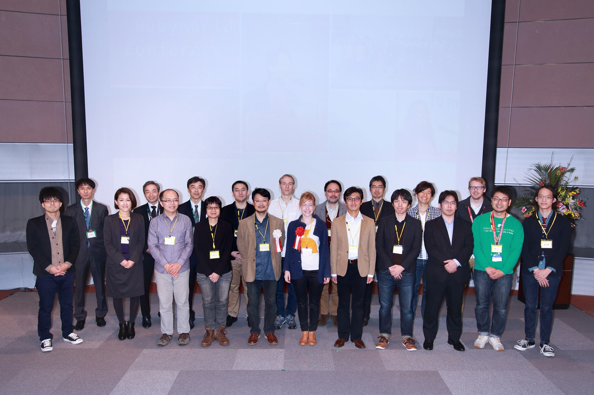
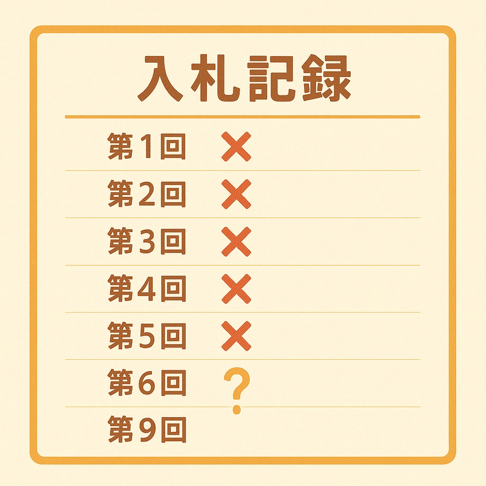
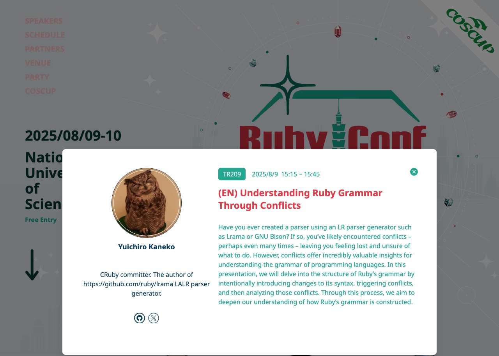

<!-- _class: lead scale-95 -->
<!-- _paginate: false -->
<!-- _header: "" -->

<style scoped>
h1 { font-size: 4em; padding: 0 0; margin: 0.25em 0;}
h2 { font-size: 2.5em;  padding: 0 0; margin: 0.25em 0;}
</style>

# Parsing Taiwanese Like Code
## 3-Phase Analysis of POJ Romanization with Ruby

**Mu-Fan Teng (鄧慕凡)**

### RubyWorld Conference 2025

#### Kunibiki Messe, Shimane | Nov. 7, 2025

---

<!-- _class: center scale-95 -->

# About Me

**Mu-Fan Teng (鄧慕凡)**
- Known as Ryudo Awaru in Japan
- Founder of 5xRuby CO., LTD
- Ruby Evangelist in Taiwan
- Chief Organizer of RubyConf Taiwan
- 3rd time speaking at RubyWorld (2015, 2023, 2025)


---

<!-- _class: scale-75 -->

# 10-Year Journey with RubyCity MATSUE

<div style="width: 90%; margin: 1.5em auto;">

<div style="display: grid; grid-template-columns: 1fr 1fr 1fr 1fr; gap: 0.5em; margin-bottom: 1em;">

  <div style="display: flex; flex-direction: column; align-items: center; justify-content: flex-end;">
    <div style="background: linear-gradient(135deg, #fff 0%, #fafafa 100%); padding: 0.6em; border-radius: 8px; border: 2px solid #CC342D; box-shadow: 0 2px 8px rgba(0,0,0,0.1);">
      <div style="color: #CC342D; font-weight: bold; margin-bottom: 0.3em; font-size: 0.8em;">🌸 First Encounter</div>
      <ul style="font-size: 0.65em; line-height: 1.2; margin: 0; padding-left: 2em; text-align: left;">
        <li>First RWC speaker</li>
        <li>Met RubyCity Matsue</li>
      </ul>
    </div>
    <div style="margin: 1em 0; font-size: 1.1em; font-weight: bold; color: #CC342D;">2015</div>
    <div style="width: 3px; height: 1em; background: #CC342D;"></div>
  </div>

  <div style="display: flex; flex-direction: column; align-items: center; justify-content: flex-end;">
    
  </div>

  <div style="display: flex; flex-direction: column; align-items: center; justify-content: flex-end;">
    <div style="background: linear-gradient(135deg, #fff 0%, #fafafa 100%); padding: 0.6em; border-radius: 8px; border: 2px solid #CC342D; box-shadow: 0 2px 8px rgba(0,0,0,0.1);">
      <div style="color: #CC342D; font-weight: bold; margin-bottom: 0.3em; font-size: 0.8em;">🤝 Deepening Ties</div>
      <ul style="font-size: 0.65em; line-height: 1.2; margin: 0; padding-left: 2em; text-align: left;">
        <li>Mayor Kamisada visited 5xRuby</li>
        <li>Strengthened bonds with RubyCity</li>
      </ul>
    </div>
    <div style="margin: 1em 0; font-size: 1.1em; font-weight: bold; color: #CC342D;">2024</div>
    <div style="width: 3px; height: 1em; background: #CC342D;"></div>
  </div>

  <div style="display: flex; flex-direction: column; align-items: center; justify-content: flex-end;">
    
  </div>

</div>

<div style="position: relative; height: 8px; background: #CC342D; border-radius: 4px; margin: 0;">

  <div style="position: absolute; left: 12.5%; top: 50%; transform: translate(-50%, -50%);">
    <div style="width: 20px; height: 20px; background: #CC342D; border: 4px solid white; border-radius: 50%; box-shadow: 0 0 0 2px #CC342D; position: relative; z-index: 10;"></div>
  </div>

  <div style="position: absolute; left: 37.5%; top: 50%; transform: translate(-50%, -50%);">
    <div style="width: 20px; height: 20px; background: #CC342D; border: 4px solid white; border-radius: 50%; box-shadow: 0 0 0 2px #CC342D; position: relative; z-index: 10;"></div>
  </div>

  <div style="position: absolute; left: 62.5%; top: 50%; transform: translate(-50%, -50%);">
    <div style="width: 20px; height: 20px; background: #CC342D; border: 4px solid white; border-radius: 50%; box-shadow: 0 0 0 2px #CC342D; position: relative; z-index: 10;"></div>
  </div>

  <div style="position: absolute; left: 87.5%; top: 50%; transform: translate(-50%, -50%);">
    <div style="width: 20px; height: 20px; background: #CC342D; border: 4px solid white; border-radius: 50%; box-shadow: 0 0 0 2px #CC342D; position: relative; z-index: 10;"></div>
  </div>

</div>

<div style="display: grid; grid-template-columns: 1fr 1fr 1fr 1fr; gap: 0.5em; margin-top: 1em;">

  <div style="display: flex; flex-direction: column; align-items: center; justify-content: flex-start;">
    <div style="width: 0px; height: 1em; background: #CC342D; margin-bottom: 1em;"></div>
    
  </div>

  <div style="display: flex; flex-direction: column; align-items: center; justify-content: flex-start;">
    <div style="width: 3px; height: 1em; background: #CC342D;"></div>
    <div style="margin: 1em 0; font-size: 1.1em; font-weight: bold; color: #CC342D;">2023</div>
    <div style="background: linear-gradient(135deg, #fff 0%, #fafafa 100%); padding: 0.6em; border-radius: 8px; border: 2px solid #CC342D; box-shadow: 0 2px 8px rgba(0,0,0,0.1);">
      <div style="color: #CC342D; font-weight: bold; margin-bottom: 0.3em; font-size: 0.8em;">💝 Partnership Begins</div>
      <ul style="font-size: 0.65em; line-height: 1.2; margin: 0; padding-left: 2em; text-align: left;">
        <li>RubyCity proposed collaboration</li>
        <li>Met mayor at city hall</li>
        <li>Returned to RWC stage</li>
      </ul>
    </div>
  </div>

  <div style="display: flex; flex-direction: column; align-items: center; justify-content: flex-start;">
    <div style="width: 0px; height: 1em; background: #CC342D; margin-bottom: 1em;"></div>
    
  </div>

  <div style="display: flex; flex-direction: column; align-items: center; justify-content: flex-start;">
    <div style="width: 3px; height: 1em; background: #CC342D;"></div>
    <div style="margin: 1em 0; font-size: 1.1em; font-weight: bold; color: #CC342D;">2025</div>
    <div style="background: linear-gradient(135deg, #fff 0%, #fafafa 100%); padding: 0.6em; border-radius: 8px; border: 2px solid #CC342D; box-shadow: 0 2px 8px rgba(0,0,0,0.1);">
      <div style="color: #CC342D; font-weight: bold; margin-bottom: 0.3em; font-size: 0.8em;">💍 Official Partnership</div>
      <ul style="font-size: 0.65em; line-height: 1.2; margin: 0; padding-left: 2em; text-align: left;">
        <li>MOU signed at RubyConf Taiwan<BR/>× COSCUP 2025</li>
        <li>Formal bond with RubyCity</li>
      </ul>
    </div>
  </div>

</div>

</div>

---

<!-- _class: center -->

# About 5xRuby

**"Creating beloved products with technologies we love"**

- **Founded**: 2014 (Taipei, Taiwan)
- **Expertise**: Software development centered on Ruby/Rails
- **Track Record**: Startup systems development, government collaboration projects

---

<!-- _class: scale-85 -->

# 5xRuby's Business

<div class="two-columns">

<div>

<div style="text-align: center;">


</div>

## 1. Software Development Services
- **Taiwan's leading Ruby development company** (Since 2014)
- Cloud & on-premise infrastructure operations
- International presence: Japan, US, Singapore
- Long-term partnerships from startups to public companies
- https://5xruby.com/en

</div>

<div>

<div style="text-align: center;">


</div>

## 2. SOSI Product
- Secure remote access management system
- Bastion server functionality
- Browser-based VDI solution
- https://www.sosi.com.tw

</div>

</div>

---

<!-- _class: scale-90 -->

# Agenda

<div class="two-columns">

<div>

## Today's Content

1. **The Story of No Bidders**
   - Why did nobody dare to bid?

2. **What is Tâi-lô (POJ)?**
   - Taiwanese romanization system

3. **Word Segmentation Alignment Implementation**
   - GSUB-based approach

4. **Meeting the Parser**
   - Reimplementation with Parslet

5. **Ruby's Strengths**
   - Conclusion and summary

</div>

<div style="text-align: center;">

### Slide Materials

#### https://rwc2025.ryudo.tw


</div>

</div>

---

<!-- _class: lead -->

# The Story of No Bidders

**Why did nobody dare to bid?**

---

<!-- _class: scale-95 -->

# Peculiarities of Taiwan Government Projects

<div class="three-columns">

<div>

<div style="text-align: center;">


</div>

### Technical Constraints
- Dependency on Microsoft products
- .NET/MS-SQL/Windows Server
- Ruby/Rails tends to lose bids

</div>

<div>

<div style="text-align: center;">


</div>

### Process Issues
- Inadequate RFPs (Request for Proposals)
- Lack of technical expertise among reviewers
- Gap between requirements and reality

</div>

<div>

<div style="text-align: center;">


</div>

### Hidden Costs
- Massive documentation requirements
- Security audits & vulnerability assessments
- On-site operational support mandatory

</div>

</div>

---

<!-- _class: scale-90 -->

# Lessons from 8 Consecutive Losses

<div class="two-columns">

<div>

<div style="text-align: center;">



</div>

## Reasons for Rejection (Non-technical)
- Specifications requiring Microsoft products
- "Compatibility requirements" with existing systems
- Opaque evaluation criteria
- Not price competition, but technology stack constraints

</div>

<div>

<div style="text-align: center;">


</div>

## 9th Attempt: Surprising Development
- **Competitors: Zero**
- "Why is nobody bidding?"
- Official's confusion: "Are you really sure?"
- **What happened?**

</div>

</div>

---

<!-- _class: center highlight -->

# The Truth After Winning

**"Word segmentation is too complex —**
**nobody dares to tackle it"**

---

<!-- _class: lead -->

# What is Tâi-lô (POJ)?

**Understanding through similarities with Japanese**

---

<!-- _class: scale-85 -->

# What is Tâi-lô (Taiwanese Romanization)?

| Context (Kanji) | Context (POJ) |
|------------------|------------------|
| 去**日本**食壽司 | khì **Ji̍t-pún** tsia̍h sú-sih |
| 香港、澳門...、臺灣佮**日本** | Hiong-káng, Ò-mn̂g...Tâi-uân kah **Ji̍t-pún** |
| 的時，**日本**義工共臺灣人 | ê sî, **Ji̍t-pún** gī-kang kā Tâi-uân-lâng |

<div class="two-columns">

<div>

## Taiwanese Romanization
- **Official name**: Taiwan Southern Min Romanization System
- **Abbreviation**: Tâi-lô
- **Established**: October 2006, announced by Taiwan MOE
- **Status**: Official romanization system for Taiwanese

</div>

<div>

## Not Mandarin Chinese
- **Taiwanese**: Southern Min language family
- **Features**:
  - 9 tones
  - Unique consonant & vowel system
  - Nasal markers (nn)
- **History**: Based on 19th century POJ with IPA elements

</div>

</div>

---

<!-- _class: scale-80 -->

# Writing Systems: Japanese vs. Taiwanese

<div class="two-columns">

<div>

## Japanese
- **Kanji** ↔ **Hiragana/Katakana**
- Examples:
  - 「生」→ sei/shou/nama/i...
  - "On-yomi" and "Kun-yomi"
  - Reading varies by context

</div>

<div>

## Taiwanese
- **Kanji** ↔ **POJ (Pe̍h-ōe-jī)**
- Examples:
  - 「夫」→ hu
  - 「膚」→ hu (homophone)
- **Similarity**: Homophones exist
- **Difference**: This system requires exact 1:1 matching between Kanji and POJ within sentences

</div>

</div>

---

<!-- _class: scale-80 -->

# Real Example of Word Segmentation Alignment

<div style="background: #f5f5f5; padding: 1.5em; border-radius: 8px; margin: 1em 0;">

**Input Data (Before segmentation):**
- Kanji: `紲落來看新竹市明仔載二十六號的天氣`
- POJ: `suà-lo̍h lâi-khuànn Sin-tik-tshī bîn-á-tsài gī-tsap-lak hō ê thinn-khì`

**Expected Output (After alignment):**

| Kanji | POJ |
|------|--------|
| 紲落 | suà-lo̍h |
| 來看 | lâi-khuànn |
| 新竹市 | Sin-tik-tshī |
| 明仔載 | bîn-á-tsài |
| 二十六 | gī-tsap-lak |
| 號 | hō |
| 的 | ê |
| 天氣 | thinn-khì |

</div>

---

<!-- _class: lead -->

# Word Segmentation Alignment Implementation

**Pattern Rules and 4-Step Processing Flow**

---

<!-- _class: scale-70 -->

# Systematizing Pattern Rules

<div class="four-columns">

<div>

## Quotation Marks (8 rules)

```ruby
# Smart quotes
/''/ => "'"

# Separation
/(.)('')(.)/ => '\1 \2 \3'
/(.)(")(.)/ => '\1 \2 \3'

# Start/End of line
/^"/ => '" '
/"$/ => ' "'
```

</div>

<div>

## Parentheses (6 rules)

```ruby
# Full-width parentheses
/（([^（]+)/ => ' （ \1'
/([^）]+)）/ => '\1 ） '

# Alphanumeric optimization
/\(\s([a-z0-9]+)\s\)/
  => '(\1)'
```

</div>

<div>

## Ellipsis (7 rules)

```ruby
# Three-dot leader
/\s\.\s\.\s\.$/
  => ' ...'
'. ..' => '...'

# Taiwanese style
/(‧‧‧)([^‧])/
  => '\1 \2'
```

</div>

<div>

## Punctuation (10+ rules)

```ruby
# Comma, Period
/(.)(,)(.)/ => '\1 \2 \3'
/([^\.])(\.)/ => '\1 \2'

# Em dash
'─' => ' ─ '

# Colon
/(.)(:)(.)/ => '\1 \2 \3'
```

</div>

</div>

**Total: 65+ Pattern Rules Systematized**

---

<!-- _class: scale-80 -->

# Overall Flow: Step 1 - Kanji Segmentation

**Process flow:** Kanji text → Symbol normalization → CJK character scan → Special combinations → kanji_array

<div class="three-columns">

<div>

## Step 1-1: Symbol Normalization

```ruby
kanji = "紲落來看新竹市明仔載。"
normalized = apply_kanji_patterns(kanji)
# => "紲落來看新竹市明仔載 。"
```

## Step 1-2: Scan CJK Characters

```ruby
RXP_SPK = /[\p{Han}\p{Katakana}
  \p{Hiragana}\p{Hangul}
  \u3000-\u303F\uFF00-\uFFEF]|
  [^\p{Han}\p{Katakana}
  \p{Hiragana}\p{Hangul}
  \u3000-\u303F\uFF00-\uFFEF]+/x
tokens = normalized.scan(RXP_SPK)
```

</div>

<div>

## Characters Recognized by RXP_SPK

**Unicode Character Properties:**

- **\p{Han}**
  Kanji (CJK)

- **\p{Katakana}**
  Japanese Katakana

- **\p{Hiragana}**
  Japanese Hiragana

- **\p{Hangul}**
  Korean Hangul

- **\u3000-\u303F**
  CJK Symbols & Punctuation

- **\uFF00-\uFFEF**
  Fullwidth ASCII & Halfwidth Katakana

</div>

<div>

## Step 3: Special Combinations & Results

```ruby
# Step 3: Process special combinations
combined = combine_special_pairs(tokens)

# Example: Symbols to treat together
# "……" + "。" => "……。"
# "』" + "。" => "』。"
# "——" + character => "——" + character

# Final result
kanji_array = combined.split
# => ["紲落", "來看", "新竹市",
#     "明仔載", "。"]
```

**Key Points:**
- Handles multilingual text
- Based on Unicode standards
- Symbol pre-processing for splitting

</div>

</div>

---

<!-- _class: scale-80 -->

# Overall Flow: Step 2 - POJ Segmentation

**Process flow:** POJ text → Symbol normalization → Space splitting → roman_array

<div class="three-columns">

<div>

## Step 1: Symbol Normalization

```ruby
# Apply ROMAN_GSUB_PATTERNS
roman = "suà-lo̍h lâi-khuànn,Sin-tik-tshī"
normalized = apply_roman_patterns(roman)
# => "suà-lo̍h lâi-khuànn , Sin-tik-tshī"

# Normalize with 65+ patterns:
# - Add spaces around quotation marks
# - Separate commas and periods
# - Process parentheses
# - Normalize tone marks
# - PRESERVE hyphens (Important!)
```

**Key Points:**
- **Preserve** hyphens
- Separate symbols and add spaces
- Normalize Unicode tone marks

</div>

<div>

## Step 2: Space Splitting

```ruby
# Roman side is very simple
def splitted_roman
  washed_roman
    .split(/\s/)
    .compact_blank
end

# Example:
"suà-lo̍h lâi-khuànn , Sin-tik-tshī"
  .split(/\s/)
# => ["suà-lo̍h",
#     "lâi-khuànn",
#     ",",
#     "Sin-tik-tshī"]
```

**Important Design:**
- **Don't split by hyphens**
- **Split only by spaces**
- Preserve syllable structure within words

</div>

<div>

## Final Results & Features

```ruby
# Generate roman_array
roman_array = splitted_roman
# => ["suà-lo̍h",
#     "lâi-khuànn",
#     ",",
#     "Sin-tik-tshī"]
```

**POJ Side Features:**

- ✅ **Simple**: Only 2 steps
- ✅ **Predictable**: Split by spaces
- ✅ **Syllable preservation**: Keep hyphens
- ✅ **Symbol separation**: Independent tokens

**Difference from Kanji side:**
- No CJK character scanning needed
- No special combination processing
- Clear splitting rules

</div>

</div>

---

<!-- _class: scale-80 -->

# Overall Flow: Step 3 - Array Construction & Validation

**Process flow:** Combine arrays → Balance validation

<div class="three-columns">

<div>

## Aligned Arrays

```ruby
# Results from Step 1, 2
roman_array = [
  "suà-lo̍h",
  "lâi-khuànn",
  "Sin-tik-tshī"
]

kanji_array = [
  "紲落",
  "來看",
  "新竹市"
]
```

**Key Points:**
- Already aligned by syllable count
- 1:1 correspondence

</div>

<div>

## Combining with zip

```ruby
# Combine with zip
pairs = roman_array.zip(
  kanji_array
)

# Result
# => [
#   ["suà-lo̍h", "紲落"],
#   ["lâi-khuànn", "來看"],
#   ["Sin-tik-tshī", "新竹市"]
# ]
```

**Ruby-like Conciseness:**
- Automatically pair two arrays
- Complete in one line

</div>

<div>

## Balance Validation

```ruby
# Three conditions
balanced = [
  roman_array.size > 0,

  roman_array.size ==
    kanji_array.size,

  kanji_array.join.size ==
    original_kanji
      .delete(' ').size
].all?
```

**Validation Results:**
```ruby
# ✅ Size: 3 = 3
# ✅ Character count: 7 = 7
arrays_balanced = true
```

</div>

</div>

---

<!-- _class: lead -->

# Meeting the Parser

**From 2024 Implementation to 2025 Insight**

---

<!-- _class: scale-90 -->

# Insight from Kaneko-san's Talk

<div style="display: grid; grid-template-columns: 1.2fr 1fr; gap: 2em; align-items: center;">

<div>



</div>

<div>

**"Understanding Ruby Grammar Through Conflicts"**

<div style="margin: 1.5em 0; padding: 1em; background: #f5f5f5; border-left: 4px solid #CC342D; border-radius: 4px;">

**Parser's 3-Phase Processing**

1. **Lexical Analysis** (字句解析)
2. **Syntax Analysis** (構文解析)
3. **Semantic Analysis** (意味解析)

</div>

<div style="margin-top: 2em; padding: 1em; background: linear-gradient(135deg, #fff3cd 0%, #fff 100%); border-radius: 8px;">

<div style="text-align: center; font-size: 1.1em; margin-bottom: 0.8em;">
💡 **"What I built was... a Parser!"**
</div>

<div style="text-align: center; font-size: 1.05em; margin-top: 1em; padding-top: 1em; border-top: 2px dashed #CC342D;">
→ **"Let's reimplement it as a Parser"**
</div>

</div>

</div>

</div>

---

<!-- _class: center highlight -->

# Conference Driven Development

**Implementing word segmentation alignment in Parser style**

---

<!-- _class: scale-85 -->

# Meeting Parslet gem

**A DSL library for writing Parsers in Ruby**

<div class="two-columns">

<div>

## Why Parslet?

- **PEG Parser**: Parsing Expression Grammar
- **Ruby DSL**: Define parsers using Ruby syntax
- **Clear Structure**: Naturally implements 3-phase design

```ruby
# Basic Parslet form
class MyParser < Parslet::Parser
  # Phase 1 & 2: Rule definition
  rule(:word) { match['a-z'].repeat(1) }
  rule(:sentence) { word >> space }

  root(:sentence)
end
```

</div>

<div>

## Parslet's Design Philosophy

Parslet's design naturally encourages **3 Phases**:

**Phase 1: Lexical Analysis**
- Define token types with `rule()`
- Character patterns with `match[]`, `str()`

**Phase 2: Syntax Analysis**
- Combine rules with `>>`, `|`
- Automatically build AST

**Phase 3: Semantic Analysis**
- Transform with `Transform` class
- AST → Final data structure

</div>

</div>

---

---

<!-- _class: scale-75 -->

# Parslet DSL Basics

<div class="three-columns">

<div>

## Basic Syntax

### `rule()` - Define Rules

```ruby
rule(:letter) { match['a-zA-Z'] }
rule(:digit) { match['0-9'] }
```

**Meaning**: Define reusable parser rules

### `match[]` - Character Class

```ruby
match['a-z']           # a-z
match['a-zA-Z0-9']     # Alphanumeric
match['\u0300-\u036F'] # Tone marks
```

**Meaning**: Same as regex `[...]`

### `str()` - String Match

```ruby
str('-')      # Hyphen
str('--')     # Double hyphen
str(' - ')    # Space-hyphen-space
```

**Meaning**: Exact string match

</div>

<div>

## Combinations

### `>>` - Sequence

```ruby
# A followed by B
rule(:word) { letter >> letter }
```

**Meaning**: Ordered concatenation (AND)

### `|` - Choice

```ruby
# A or B (order matters!)
rule(:token) do
  double_hyphen_word |  # Try first
  hyphenated_word       # Try later
end
```

**Important**: PEG adopts first match

### `.repeat` - Repetition

```ruby
match['a-z'].repeat      # 0 or more
match['a-z'].repeat(1)   # 1 or more
```

</div>

<div>

## AST Construction

### `.as(:symbol)` - Naming

```ruby
# Type token
rule(:word) {
  letter.repeat(1).as(:word)
}

# Generated AST
{ word: "hello" }
```

**Meaning**: Name for AST identification

### `root()` - Start Rule

```ruby
# Specify parser entry
rule(:sentence) {
  token >> space?
}
root(:sentence)
```

**Meaning**: Specify where to start parsing

</div>

</div>

---

<!-- _class: scale-60 -->

# Regexp → Parslet Conversion (From GSUB Patterns to Parser Rules)

<div class="two-columns">

<div>

## Punctuation Processing

### GSUB Approach

```ruby
# Part of 65+ patterns
ROMAN_GSUB_PATTERNS = {
  /,/ => ' , ',      # Space around comma
  /\./ => ' . ',     # Space around period
  /!/ => ' ! ',      # Space around exclamation
  /\?/ => ' ? ',     # Space around question
  # ... 60+ more patterns
}

# Apply
text = "suà-lo̍h,lâi-khuànn"
ROMAN_GSUB_PATTERNS.each do |pattern, replacement|
  text = text.gsub(pattern, replacement)
end
# => "suà-lo̍h , lâi-khuànn"
```

**Feature**: Surround symbols with spaces → split later

</div>

<div>

### Parslet Approach

```ruby
# Directly recognize punctuation as tokens
rule(:punctuation) do
  str('...') | str('⋯⋯') | str('……') |  # Multi-char first
  match[',.:;()!?？！/~、─…⋯'] |         # Single-char
  match["\"'\u201C\u201D\u2018\u2019"] |  # Quotes
  match['\u3000-\u303F']                  # CJK symbols
end

# Token rule
rule(:token) do
  hyphenated_word.as(:word) |
  punctuation.as(:punct)
end
```

**Input**: `"suà-lo̍h,lâi-khuànn"`

**Output (AST)**:
```ruby
[
  { word: "suà-lo̍h" },
  { punct: "," },
  { word: "lâi-khuànn" }
]
```

**Feature**: Structured as tokens → no split needed

</div>

</div>

---

<!-- _class: scale-65 -->

# Regexp → Parslet Conversion (Hyphen Processing & Syllable-Based Kanji Alignment)

<div class="two-columns">

<div>

## Preserving Hyphens (Page 17 & 18)

### GSUB Approach

```ruby
# Step 1: Normalize symbols
text = "suà-lo̍h lâi-khuànn"
# Preserve hyphens (important!)

# Step 2: Split by space
tokens = text.split(/\s/)
# => ["suà-lo̍h", "lâi-khuànn"]

# Step 3: Count syllables
syllables = "suà-lo̍h".split('-').size
# => 2

# Step 4: Get corresponding Kanji
kanji_chars = ["紲", "落", "來", "看"]
combined = kanji_chars.shift(syllables).join
# => "紲落"
```

**Principle**: Hyphen = syllable separator

</div>

<div>

### Parslet Approach

```ruby
# Recognize hyphenated word as single token
rule(:hyphenated_word) do
  syllable >>
  (single_hyphen >> syllable).repeat
end

# "suà-lo̍h" → { word: "suà-lo̍h" }
```

**Syllable counting**:
```ruby
# Phase 3: Transform
rule(word: simple(:w)) do
  syllables = w.to_s.split('-').size
  # => 2
end
```

**Kanji alignment**:
```ruby
# Syllable count = Kanji char count
"suà-lo̍h".split('-').size  # => 2
"紲落".chars.size            # => 2
# ✅ Match!
```

**Principle**: Parser preserves syllable structure → automatic alignment

</div>

</div>

---

<!-- _class: scale-80 -->

# Comparison with Ruby Parser

<div class="two-columns">

<div>

## Ruby Parser (Prism)

```ruby
# Input
"def foo(x); x + 1; end"
```

**Phase 1: Lexical**
```
[DEF][IDENTIFIER][LPAREN][IDENTIFIER]
[RPAREN][SEMICOLON][IDENTIFIER][PLUS]
[INTEGER][SEMICOLON][END]
```

**Phase 2: Syntax**
```ruby
DefNode(
  name: :foo,
  parameters: ParametersNode(...),
  body: StatementsNode(...)
)
```

**Phase 3: Semantic**
- Type checking
- Scope analysis
- Code generation

</div>

<div>

## Tâi-lô Parser (RomanParserPure)

```
# Input
"suà-lo̍h lâi-khuànn"
```

**Phase 1: Lexical**
```
[suà-lo̍h][lâi-khuànn]
```

**Phase 2: Syntax**
```ruby
{
  sentence: [
    { word: "suà-lo̍h" },
    { word: "lâi-khuànn" }
  ]
}
```

**Phase 3: Semantic**
- AST transformation
- Array generation
```ruby
["suà-lo̍h", "lâi-khuànn"]
```

**Note**: Experimental implementation (educational purpose)

</div>

</div>

---

<!-- _class: scale-80 -->

# Why Kanji Doesn't Need a Parser?

**Natural correspondence: POJ syllable count = Kanji character count**

<div class="two-columns">

<div>

## POJ Parser Output

```ruby
# RomanParserPure result
roman_array = [
  "suà-lo̍h",      # 2 syllables (suà + lo̍h)
  "lâi-khuànn",    # 2 syllables (lâi + khuànn)
  "Sin-tik-tshī"   # 3 syllables (Sin + tik + tshī)
]

# Hyphen count = syllable boundary
"suà-lo̍h".split('-').size      # => 2
"Sin-tik-tshī".split('-').size  # => 3
```

**Key Points:**
- Hyphens mark syllable separation
- Syllable count is easily calculated
- Parser preserves syllable structure

</div>

<div>

## Automatic Kanji Alignment

```ruby
# Kanji text (no spaces)
kanji = "紲落來看新竹市"

# Split based on POJ syllable count
# 1. "suà-lo̍h" = 2 syllables
#    → Take 2 Kanji chars: "紲落"
# 2. "lâi-khuànn" = 2 syllables
#    → Take 2 Kanji chars: "來看"
# 3. "Sin-tik-tshī" = 3 syllables
#    → Take 3 Kanji chars: "新竹市"

kanji_array = ["紲落", "來看", "新竹市"]
```

**Conclusion:**
- ✅ Split Kanji using POJ Parser's syllable info
- ✅ Kanji Parser is unnecessary
- ✅ Achieved through simple character counting

</div>

</div>


---

<!-- _class: scale-80 -->

# Try RomanParserPure Yourself

**Published on GitHub: Test Data & Verification Scripts**

<div class="two-columns">

<div style="display: flex; flex-direction: column; align-items: center; justify-content: center;">


**https://github.com/ryudoawaru/rwc2025-slide**

**Includes:**
- Complete RomanParserPure implementation
- WASHING_PATTERNS (65+ rules)
- 3000 real corpus data samples

</div>

<div>
<!-- _class: scale-75 -->
## 🧪 Test Results

```bash
$ ruby test_parser.rb

================================================================================
Testing RomanParserPure with 3000 records
================================================================================
[██████████████████████████████████████████████████] 100.0% (3000/3000)

================================================================================
Final Results
================================================================================
Total records:    3000
Parse success:    3000 (100.0%)
Parse errors:     0 (0.0%)
================================================================================

🎉 PERFECT! 100% success rate achieved!
```

**Key Highlights:**
- ✅ **100% Parse Success - All 3000 records accurately parsed**
- ✅ **Zero Errors - Practical and theoretical harmony**

</div>

</div>

---

<!-- _class: lead -->

# Project Results

**Taiwanese Language Education System Realized with Ruby**

---

<!-- _class: scale-80 -->

# NAER Project: Taiwanese Corpus System

- **Public URL**: https://tggl.naer.edu.tw
- **Client**: Ministry of Education / National Academy for Educational Research

<div style="text-align: center; margin: 1.5em 0;">


</div>

---

<!-- _class: scale-80 -->

# Main Feature 1: Corpus Search

**Integrated search system for Kanji, POJ, and audio files**

<div style="text-align: center; margin: 1.5em 0;">


</div>

**Features:**
- Simultaneous display of Kanji and Tâi-lô (POJ)
- Audio file playback
- Context display
- Advanced search filters

---

<!-- _class: scale-80 -->

# Main Feature 2: Textbook Vocabulary

**Database of Taiwanese vocabulary used in Taiwan's textbooks**

<div style="text-align: center; margin: 1.5em 0;">

<video controls width="720" autoplay loop muted>
  <source src="images/textbook_search.webm" type="video/webm">
</video>

</div>

---

<!-- _class: scale-80 -->

# Main Feature 3: Grammar Points Search

**Search for important Taiwanese grammar patterns and examples**

<div style="text-align: center; margin: 1.5em 0;">

<video controls width="720" autoplay loop muted>
  <source src="images/grammar-search.webm" type="video/webm">
</video>

</div>

---

<!-- _class: center highlight -->

# Conclusion

**Universality of Compiler Theory**
- Programming language Parser → Natural language processing
- Ruby's 3-phase analysis → Taiwanese word segmentation alignment

**With the right tools and understanding of principles, complex problems can be solved**

---

<!-- _class: scale-95 -->

# Thank You

<div class="three-columns">

<div style="text-align: center;">

## 📦 Slides & Code


**https://github.com/ryudoawaru/rwc2025-slide**

</div>

<div style="text-align: center;">

## 🏢 5xRuby


**https://5xruby.com**

</div>

<div style="text-align: center;">

## 🎪 Booth Exhibition


**Please visit us!**

</div>

</div>

<script type="module">
  import mermaid from 'https://cdn.jsdelivr.net/npm/mermaid@10/dist/mermaid.esm.min.mjs';
  mermaid.initialize({ startOnLoad: true });
</script>
