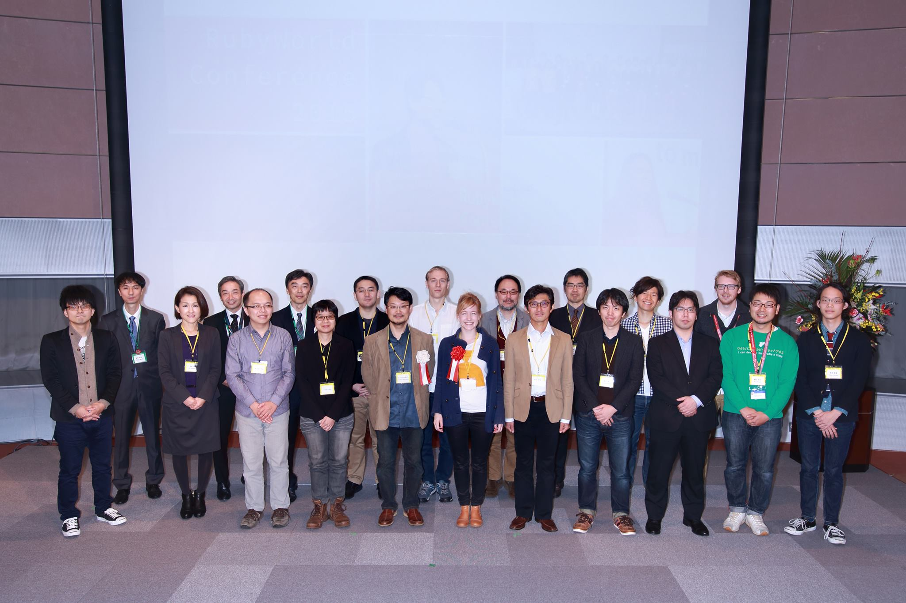
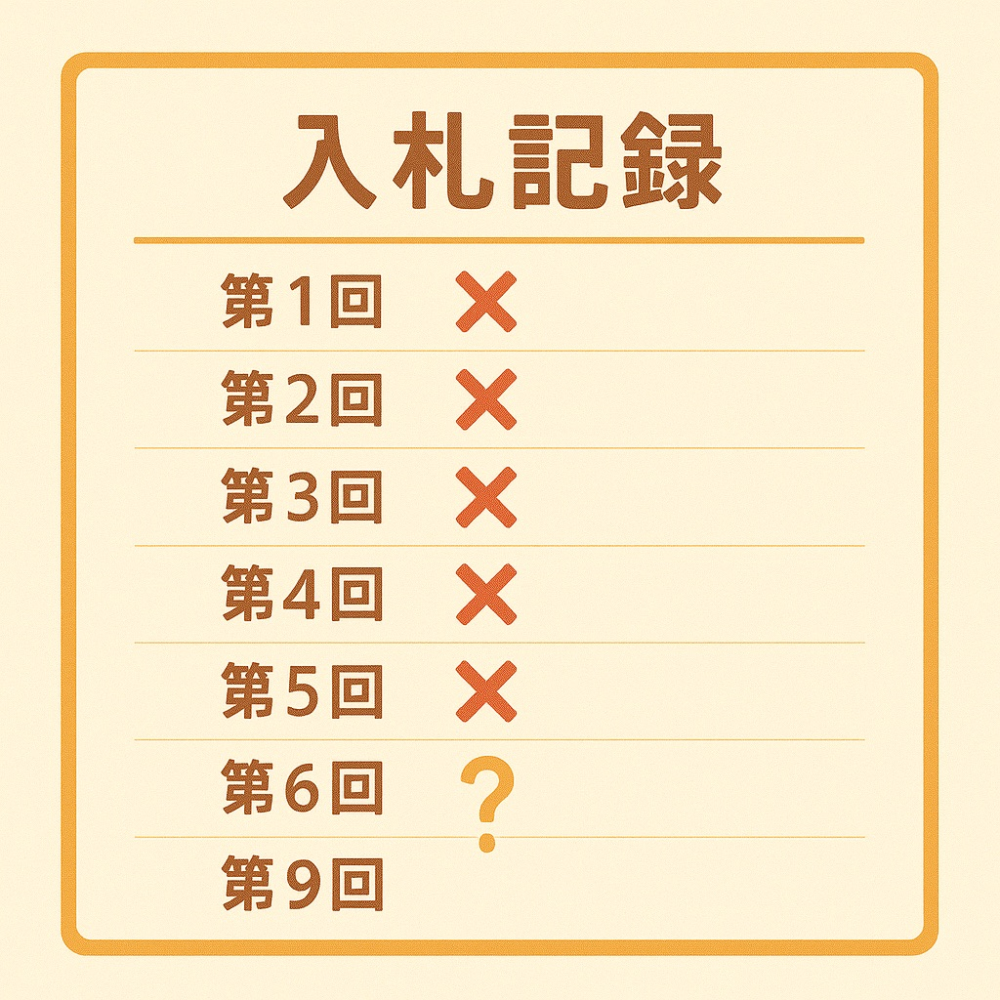
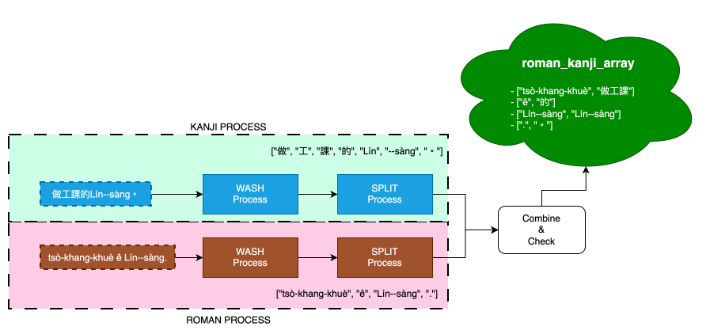
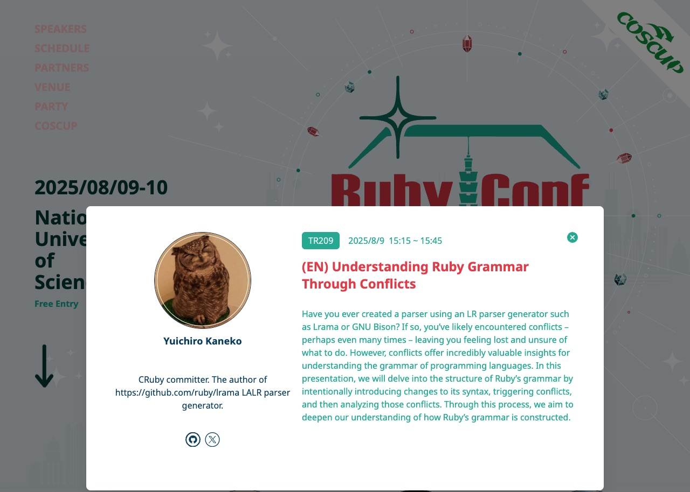

<!-- _class: lead scale-95 -->
<!-- _paginate: false -->
<!-- _header: "" -->

<style scoped>
h1 { font-size: 4em; padding: 0 0; margin: 0.25em 0;}
h2 { font-size: 2.5em;  padding: 0 0; margin: 0.25em 0;}
</style>

# Parsing Taiwanese Like Code
## 3-Phase Analysis of POJ Romanization with Ruby

**Mu-Fan Teng**

### RubyWorld Conference 2025

#### Shimane Prefectural Industrial Trade Hall "Kunibiki Messe" Nov. 7, 2025

---

<!-- _class: center scale-95 -->
<!-- _header: "" -->

# Self Introduction

**Mu-Fan Teng**
- Known as Ryudo Awaru (竜堂 終) in Japan
- Founder of 5xRuby CO., LTD
- Ruby Evangelist in Taiwan
- Chief Organizer of RubyConf Taiwan
- Third time speaking at RubyWorld (2015, 2023, 2025)


---

<!-- _class: scale-75 -->

# 10-Year Story with RubyCity Matsue

<div style="width: 90%; margin: 1.5em auto;">

<div style="display: grid; grid-template-columns: 1fr 1fr 1fr 1fr; gap: 0.5em; margin-bottom: 1em;">

  <div style="display: flex; flex-direction: column; align-items: center; justify-content: flex-end;">
    <div style="background: linear-gradient(135deg, #fff 0%, #fafafa 100%); padding: 0.6em; border-radius: 8px; border: 2px solid #CC342D; box-shadow: 0 2px 8px rgba(0,0,0,0.1);">
      <div style="color: #CC342D; font-weight: bold; margin-bottom: 0.3em; font-size: 0.8em;">🌸 First Meeting</div>
      <ul style="font-size: 0.65em; line-height: 1.2; margin: 0; padding-left: 2em; text-align: left;">
        <li>First time speaking at RWC</li>
        <li>Met RubyCity Matsue</li>
      </ul>
    </div>
    <div style="margin: 1em 0; font-size: 1.1em; font-weight: bold; color: #CC342D;">2015</div>
    <div style="width: 3px; height: 1em; background: #CC342D;"></div>
  </div>

  <div style="display: flex; flex-direction: column; align-items: center; justify-content: flex-end;">
    
  </div>

  <div style="display: flex; flex-direction: column; align-items: center; justify-content: flex-end;">
    <div style="background: linear-gradient(135deg, #fff 0%, #fafafa 100%); padding: 0.6em; border-radius: 8px; border: 2px solid #CC342D; box-shadow: 0 2px 8px rgba(0,0,0,0.1);">
      <div style="color: #CC342D; font-weight: bold; margin-bottom: 0.3em; font-size: 0.8em;">🤝 Deepening Bond</div>
      <ul style="font-size: 0.65em; line-height: 1.2; margin: 0; padding-left: 2em; text-align: left;">
        <li>Mayor Kamimori visited 5xRuby</li>
        <li>Strengthening ties with RubyCity</li>
      </ul>
    </div>
    <div style="margin: 1em 0; font-size: 1.1em; font-weight: bold; color: #CC342D;">2024</div>
    <div style="width: 3px; height: 1em; background: #CC342D;"></div>
  </div>

  <div style="display: flex; flex-direction: column; align-items: center; justify-content: flex-end;">
    
  </div>

</div>

<div style="position: relative; height: 8px; background: #CC342D; border-radius: 4px; margin: 0;">

  <div style="position: absolute; left: 12.5%; top: 50%; transform: translate(-50%, -50%);">
    <div style="width: 20px; height: 20px; background: #CC342D; border: 4px solid white; border-radius: 50%; box-shadow: 0 0 0 2px #CC342D; position: relative; z-index: 10;"></div>
  </div>

  <div style="position: absolute; left: 37.5%; top: 50%; transform: translate(-50%, -50%);">
    <div style="width: 20px; height: 20px; background: #CC342D; border: 4px solid white; border-radius: 50%; box-shadow: 0 0 0 2px #CC342D; position: relative; z-index: 10;"></div>
  </div>

  <div style="position: absolute; left: 62.5%; top: 50%; transform: translate(-50%, -50%);">
    <div style="width: 20px; height: 20px; background: #CC342D; border: 4px solid white; border-radius: 50%; box-shadow: 0 0 0 2px #CC342D; position: relative; z-index: 10;"></div>
  </div>

  <div style="position: absolute; left: 87.5%; top: 50%; transform: translate(-50%, -50%);">
    <div style="width: 20px; height: 20px; background: #CC342D; border: 4px solid white; border-radius: 50%; box-shadow: 0 0 0 2px #CC342D; position: relative; z-index: 10;"></div>
  </div>

</div>

<div style="display: grid; grid-template-columns: 1fr 1fr 1fr 1fr; gap: 0.5em; margin-top: 1em;">

  <div style="display: flex; flex-direction: column; align-items: center; justify-content: flex-start;">
    <div style="width: 0px; height: 1em; background: #CC342D; margin-bottom: 1em;"></div>
    
  </div>

  <div style="display: flex; flex-direction: column; align-items: center; justify-content: flex-start;">
    <div style="width: 3px; height: 1em; background: #CC342D;"></div>
    <div style="margin: 1em 0; font-size: 1.1em; font-weight: bold; color: #CC342D;">2023</div>
    <div style="background: linear-gradient(135deg, #fff 0%, #fafafa 100%); padding: 0.6em; border-radius: 8px; border: 2px solid #CC342D; box-shadow: 0 2px 8px rgba(0,0,0,0.1);">
      <div style="color: #CC342D; font-weight: bold; margin-bottom: 0.3em; font-size: 0.8em;">💝 Partnership Proposal</div>
      <ul style="font-size: 0.65em; line-height: 1.2; margin: 0; padding-left: 2em; text-align: left;">
        <li>Collaboration proposal from RubyCity</li>
        <li>Meeting with mayor at city hall</li>
        <li>Returned to RWC stage</li>
      </ul>
    </div>
  </div>

  <div style="display: flex; flex-direction: column; align-items: center; justify-content: flex-start;">
    <div style="width: 0px; height: 1em; background: #CC342D; margin-bottom: 1em;"></div>
    
  </div>

  <div style="display: flex; flex-direction: column; align-items: center; justify-content: flex-start;">
    <div style="width: 3px; height: 1em; background: #CC342D;"></div>
    <div style="margin: 1em 0; font-size: 1.1em; font-weight: bold; color: #CC342D;">2025</div>
    <div style="background: linear-gradient(135deg, #fff 0%, #fafafa 100%); padding: 0.6em; border-radius: 8px; border: 2px solid #CC342D; box-shadow: 0 2px 8px rgba(0,0,0,0.1);">
      <div style="color: #CC342D; font-weight: bold; margin-bottom: 0.3em; font-size: 0.8em;">💍 Official Partnership</div>
      <ul style="font-size: 0.65em; line-height: 1.2; margin: 0; padding-left: 2em; text-align: left;">
        <li>MOU signed at<BR/>RubyConf Taiwan × COSCUP 2025</li>
        <li>Formalized bond with RubyCity</li>
      </ul>
    </div>
  </div>

</div>

</div>

---

<!-- _class: scale-90 -->

# About 5xRuby

<div class="two-columns">

<div style="display: flex; flex-direction: column; justify-content: center; align-self: center;">

**"Creating beloved products with beloved technology"**

- **Founded**: 2014 (Taipei)
- **Expertise**: Software development centered on Ruby/Rails
- **Track Record**: Specializing in startup systems, also handling government collaborations

</div>

<div style="display: flex; align-items: center; justify-content: center; background: none; border: none; padding: 0;">


</div>

</div>

---

<!-- _class: scale-85 -->

# 5xRuby's Business

<div class="two-columns">

<div>

<div style="text-align: center;">


</div>

## 1. Contract Development Services
- **Taiwan's largest Ruby development company** (Founded 2014)
- Infrastructure operations for both cloud and on-premise
- International expansion including Japan, US, and Singapore
- Long-term partnerships from startups to listed companies
- https://5xruby.com/en

</div>

<div>

<div style="text-align: center;">


</div>

## 2. SOSI Product
- Secure remote access management system
- Bastion server functionality
- Browser-based VDI solution
- https://www.sosi.com.tw

</div>

</div>

---

<!-- _class: scale-90 -->

# Agenda

<div class="two-columns">

<div>

## Today's Content

1. **The Story of No Bidders**
   - Why did nobody dare to bid?

2. **What is POJ (Taiwanese Romanization)?**
   - Romanization system for Taiwanese

3. **Word Segmentation Alignment Implementation**
   - Implementation using GSUB

4. **Encounter with Parser**
   - Re-implementation with Parslet

5. **Project Results**
   - Ruby's strengths and achievements

6. **Conclusion**
   - Summary

</div>

<div style="text-align: center;">

### Slide Materials

#### https://rwc2025.ryudo.tw


</div>

</div>

---

<!-- _class: lead -->
<!-- _header: "" -->

# The Story of No Bidders

**Why did nobody dare to bid?**

---

<!-- _class: scale-95 -->

# Peculiarities of Taiwan Government Projects

<div class="three-columns">

<div>

<div style="text-align: center;">


</div>

### Technical Constraints
- Dependency on Microsoft products
- .NET/MS-SQL/Windows Server
- Ruby/Rails tends to lose bids

</div>

<div>

<div style="text-align: center;">


</div>

### Process Issues
- Inadequate RFP (Request for Proposal)
- Lack of expertise from project managers
- Gap between RFP and actual needs

</div>

<div>

<div style="text-align: center;">


</div>

### Hidden Costs
- Extensive documentation requirements
- Security audits and vulnerability assessments
- Mandatory on-site operational support

</div>

</div>

---

<!-- _class: scale-90 -->

# Lessons from 8 Consecutive Losses

<div class="two-columns">

<div>

<div style="text-align: center;">



</div>

## Reasons for Losses (Non-Technical)
- Requirements based on Microsoft products
- "Compatibility requirements" with existing systems
- Opaque evaluation criteria
- Not about price competition, but technology stack constraints

</div>

<div>

<div style="text-align: center;">


</div>

## 9th Time: Surprising Turn of Events
- **Competitors: Zero**
- "Why is nobody bidding?"
- Even the project manager was confused: "Are you sure about this?"
- **What happened?**

</div>

</div>

---

<!-- _class: center highlight -->
<!-- _header: "" -->
# Truth After Winning the Bid

**"Word segmentation is too complex,**
**nobody dared to touch it"**

---

<!-- _class: lead -->
<!-- _header: "" -->

# What is POJ (Taiwanese Romanization)?

**Understanding through similarities with Japanese**

---

<!-- _class: scale-85 -->

# What is Tâi-lô (Taiwanese Romanization)?

| Context (Kanji) | Context (POJ) |
|------------------|------------------|
| 去**日本**食壽司 | khì **Ji̍t-pún** tsia̍h sú-sih |
| 香港、澳門...、臺灣佮**日本** | Hiong-káng, Ò-mn̂g...Tâi-uân kah **Ji̍t-pún** |
| 的時，**日本**義工共臺灣人 | ê sî, **Ji̍t-pún** gī-kang kā Tâi-uân-lâng |

<div class="two-columns">

<div>

## Romanization for Taiwanese Language
- **Official Name**: Taiwan Minnanyu Luomazi Pinyin Fang'an
- **Abbreviation**: Tâi-lô
- **Established**: October 2006, promulgated by Taiwan's Ministry of Education
- **Status**: Official writing system for Taiwanese

</div>

<div>

## Not Mandarin Chinese
- **Taiwanese**: Minnan language family
- **Features**:
  - 9 tones
  - Unique consonant and vowel systems
  - Nasalization notation
- **History**: Developed based on POJ (Pe̍h-ōe-jī) incorporating IPA (International Phonetic Alphabet) elements

</div>

</div>

---

<!-- _class: scale-80 -->

# Writing Systems: Japanese vs Taiwanese

<div class="two-columns">

<div>

## Japanese System

**Kanji → Hiragana**

**Correspondence**:
- One group of words → One group of kana

**Examples**:
```
生活    → せいかつ
新幹線  → しんかんせん
東京駅  → とうきょうえき
```

</div>

<div>

## Taiwanese System

**Kanji → POJ**

**Correspondence**:
- One group of words → One group of POJ

**Examples**:
```
紲落      → suà-lo̍h
新竹市    → Sin-tik-tshī
明仔載    → bîn-á-tsài
```

</div>

</div>

<div style="text-align: center; margin-top: 1.5em; padding: 1em; background: #fff3cd; border-radius: 8px; border: 2px solid #ffc107;">

**Common Point**: One group of Kanji ↔ One group of phonetic symbols

**→ That's why "Word Segmentation Alignment" is necessary!**

</div>

---

<!-- _class: scale-80 -->

# Real Example of Word Segmentation Alignment

<div style="background: #f5f5f5; padding: 1.5em; border-radius: 8px; margin: 1em 0;">

**Input Data (Before Segmentation):**
- Kanji：`紲落來看新竹市明仔載二十六號的天氣`
- POJ：`suà-lo̍h lâi-khuànn Sin-tik-tshī bîn-á-tsài gī-tsap-lak hō ê thinn-khì`

**Expected Output (After Word Segmentation Alignment):**

| Kanji | POJ |
|------|--------|
| 紲落 | suà-lo̍h |
| 來看 | lâi-khuànn |
| 新竹市 | Sin-tik-tshī |
| 明仔載 | bîn-á-tsài |
| 二十六 | gī-tsap-lak |
| 號 | hō |
| 的 | ê |
| 天氣 | thinn-khì |

</div>

---

<!-- _class: lead -->
<!-- _header: "" -->

# Word Segmentation Alignment Implementation

**3-Phase Processing Flow**

---

<!-- _class: center -->
<!-- _header: "" -->


# Implementation Overview: 3 Phases


<div style="text-align: center;">



</div>

---

<!-- _class: scale-65 -->

# Phase 1: Normalization (WASH)

<div class="two-columns">

<div>

## washed_kanji - Kanji Side

```ruby
def washed_kanji
  KANJI_GSUB_PATTERNS.reduce(kanji) do |ks, (mt, kp)|
    ks.gsub(mt, kp)
  end
end
```

**Processing:**
- Insert spaces around punctuation
- Separate periods, commas, parentheses, etc.
- Properly handle POJ text (Lín--sàng)

**Example:**
```
Input:  做工課的Lín--sàng。
Output: 做工課的Lín --sàng。
```

</div>

<div>

## washed_roman - POJ Side

```ruby
def washed_roman
  ROMAN_GSUB_PATTERNS.reduce(roman) do |rs, (mt, rp)|
    rs.gsub(mt, rp)
  end
end
```

**Processing:**
- Normalize punctuation with 65+ patterns
- ✅ **Hyphens are preserved** - syllable separators
- ✅ **Double hyphens (--) also preserved** - inter-word pause

**Example:**
```
Input:  tsò-khang-khuè ê Lín--sàng.
Output: tsò-khang-khuè ê Lín--sàng .
```

</div>

</div>

---

<!-- _class: scale-80 -->

# Phase 2-1: splitted_kanji - Kanji Splitting

<div class="two-columns">

<div>

## Implementation Code

```ruby
def splitted_kanji
  combine_one_word(
    washed_kanji.scan(RXP_SPK).map do |spka|
      spka.split(/\s/)
    end.flatten.join(' ')
  ).split
end

# RXP_SPK - Identifies CJK and non-CJK characters
RXP_SPK = /[\p{Han}\p{Katakana}\p{Hiragana}
  \p{Hangul}\u3000-\u303F\uFF00-\uFFEF]|
  [^\p{Han}\p{Katakana}\p{Hiragana}
  \p{Hangul}\u3000-\u303F\uFF00-\uFFEF]+/x

# combine_one_word - Special combination handling
def combine_one_word(text)
  ONE_KANJI_WORDS.reduce(text) do |ks, (mt, kp)|
    ks.gsub(mt, kp)
  end
end
```

</div>

<div>

## Processing Explanation

1. **Character scan with RXP_SPK**
   - CJK characters (Kanji, Hiragana, etc.)
   - Non-CJK characters (POJ, numbers, etc.)
   - Character by character or grouped non-CJK sequences

2. **Special handling with combine_one_word**
   - Apply ONE_KANJI_WORDS patterns
   - Combine specific symbol sequences

3. **Split by spaces**

4. **Edge Case handling:**
   - `Lín--sàng` is recognized as a single token

## Example

**Input:** `做工課的Lín--sàng 。`
**Output:**
`["做", "工", "課", "的", "Lín--sàng", "。"]`

</div>

</div>

---

<!-- _class: scale-85 -->

# Phase 2-2: splitted_roman - POJ Splitting

<div class="two-columns">

<div>

## Implementation Code

```ruby
def splitted_roman
  washed_roman
    .split(/\s/)
    .compact_blank
end
```

**Simple! Just 3 lines**

</div>

<div>

## Processing Explanation

1. **Simple: Split by spaces**
   - Punctuation already separated in Phase 1
   - Can split by spaces alone

2. **Important design:**
   - ✅ **Don't split by hyphens**
   - ✅ **Preserve double hyphens (--)**
   - Maintain syllable structure within words

3. **compact_blank removes empty elements**

## Example

**Input:** `tsò-khang-khuè ê Lín--sàng .`
**Output:**
`["tsò-khang-khuè", "ê", "Lín--sàng", "."]`

**Syllable counts:**
- `tsò-khang-khuè` = 3 syllables
- `Lín--sàng` = 2 syllables (-- not counted in syllables)

</div>

</div>

---

<!-- _class: scale-75 -->

# Phase 3: Alignment and Validation

<div class="two-columns">

<div>

```ruby
def roman_kanji_array
  spk = splitted_kanji.dup
  splitted_roman.map do |rword|
    if rword == '--' || (SP_MIRRORS.key?(rword) &&
        #... Edge Case handling
        [rword, spss]
      end
    end
  end
end

def set_arrays
  rka = roman_kanji_array.transpose
  assign_attributes(
    roman_array: rka[0],
    kanji_array: rka[1]
  )
  self.arrays_balanced = [
    roman_array.size.positive?,
    roman_array.size == kanji_array.size,
    kanji_array.join.size ==
      washed_kanji.delete(' ').size
  ].all?
end
```

</div>

<div>

## Processing Explanation

1. **Match by syllable count**
   - Hyphen = syllable separator
   - `tsò-khang-khuè` (3 syllables) → 3 Kanji characters
   - `Lín--sàng` (2 syllables) → Roman as-is

2. **Edge Case handling:**
   - When Roman appears in Kanji side, keep as-is
   - Double hyphen (--) not counted in syllables

3. **Array combination**: Use `transpose` to separate roman/kanji

4. **Balance validation (3 conditions)**
   - ✅ Array is not empty
   - ✅ Roman and Kanji element counts match
   - ✅ Total Kanji character count matches original text

|                           |                                                                                     |
| ------------------------- | ----------------------------------------------------------------------------------- |
| **kanji_array:**      | `["做工課", "的", "Lín--sàng", "。"]`                                                  |
| **roman_array:**      | `["tsò-khang-khuè", "ê", "Lín--sàng", "."]`                                       |
| **roman_kanji_array** | `[["tsò-khang-khuè", "做工課"], ["ê", "的"], ["Lín--sàng", "Lín--sàng"], [".", "。"]]` |


</div>

</div>

---

<!-- _class: lead -->
<!-- _header: "" -->

# Encounter with Parser

**From 2024 Implementation to 2025 Insight**

---

<!-- _class: scale-90 -->

# Insight from Kaneko-san's Talk

<div style="display: grid; grid-template-columns: 1.2fr 1fr; gap: 2em; align-items: center;">

<div>



</div>

<div>

**"Understanding Ruby Grammar Through Conflicts"**

<div style="margin: 1.5em 0; padding: 1em; background: #f5f5f5; border-left: 4px solid #CC342D; border-radius: 4px;">

**Parser's 3-Phase Processing**

1. **Lexical Analysis**
2. **Syntax Analysis**
3. **Semantic Analysis**

</div>

<div style="margin-top: 2em; padding: 1em; background: linear-gradient(135deg, #fff3cd 0%, #fff 100%); border-radius: 8px;">

<div style="text-align: center; font-size: 1.1em; margin-bottom: 0.8em;">
💡 **"What I was doing was... a Parser!"**
</div>

<div style="text-align: center; font-size: 1.05em; margin-top: 1em; padding-top: 1em; border-top: 2px dashed #CC342D;">
→ **"Let's re-implement it as a Parser"**
</div>

</div>

</div>

</div>

---

<!-- _class: center highlight -->
<!-- _header: "" -->

# Conference Driven Development

**Implementing word segmentation alignment using Parser approach**

---

<!-- _class: scale-85 -->

# Discovering Parslet gem

**A DSL library for writing Parsers in Ruby**

<div class="two-columns">

<div>

## Why Parslet?

- **PEG Parser**: Parsing Expression Grammar
- **Ruby DSL**: Define Parser using Ruby syntax
- **Clear Structure**: Naturally implements 3-phase design

```ruby
# Parslet basics
class MyParser < Parslet::Parser
  # Phase 1 & 2: Rule definition
  rule(:word) { match['a-z'].repeat(1) }
  rule(:sentence) { word >> space }

  root(:sentence)
end
```

</div>

<div>

## Parslet's Design Philosophy

Parslet makes developers aware of **3 Phases**:

**Phase 1: Lexical Analysis**
- Define token types with `rule()`
- Character patterns with `match[]`, `str()`

**Phase 2: Syntax Analysis**
- Combine rules with `>>`, `|`
- Automatically construct AST

**Phase 3: Semantic Analysis**
- Transform with `Transform` class
- AST → Final data structure

</div>

</div>

---

<!-- _class: scale-75 -->

# Parslet DSL Fundamentals

<div class="three-columns">

<div>

## Basic Syntax

### `rule()` - Define Rules

```ruby
rule(:letter) { match['a-zA-Z'] }
rule(:digit) { match['0-9'] }
```

**Meaning**: Define reusable parser rules

### `match[]` - Character Classes

```ruby
match['a-z']           # a-z
match['a-zA-Z0-9']     # alphanumeric
match['\u0300-\u036F'] # tone marks
```

**Meaning**: Same as regex `[...]`

### `str()` - String Matching

```ruby
str('-')      # hyphen
str('--')     # double hyphen
str(' - ')    # space-hyphen-space
```

**Meaning**: Exact string match

</div>

<div>

## Combinations

### `>>` - Sequence

```ruby
# A followed by B
rule(:word) { letter >> letter }
```

**Meaning**: Ordered concatenation (AND)

### `|` - Alternative

```ruby
# A or B (order matters!)
rule(:token) do
  double_hyphen_word |  # try first
  hyphenated_word       # try later
end
```

**Important**: PEG takes first match

### `.repeat` - Repetition

```ruby
match['a-z'].repeat      # 0 or more
match['a-z'].repeat(1)   # 1 or more
```

</div>

<div>

## AST Construction

### `.as(:symbol)` - Naming

```ruby
# Give token a type
rule(:word) {
  letter.repeat(1).as(:word)
}

# Output AST
{ word: "hello" }
```

**Meaning**: Name for AST identification

### `root()` - Start Rule

```ruby
# Specify parser entry point
rule(:sentence) {
  token >> space?
}
root(:sentence)
```

**Meaning**: Which rule to start parsing from

</div>

</div>

---

<!-- _class: scale-60 -->

# Regexp → Parslet Conversion (From GSUB Patterns to Parser Rules)

<div class="two-columns">

<div>

## Punctuation Handling

### GSUB Approach

```ruby
# Part of 65+ patterns
ROMAN_GSUB_PATTERNS = {
  /,/ => ' , ',      # spaces around comma
  /\./ => ' . ',     # spaces around period
  /!/ => ' ! ',      # spaces around exclamation
  /\?/ => ' ? ',     # spaces around question mark
  # ... 60+ more patterns
}

# Application
text = "suà-lo̍h,lâi-khuànn"
ROMAN_GSUB_PATTERNS.each do |pattern, replacement|
  text = text.gsub(pattern, replacement)
end
# => "suà-lo̍h , lâi-khuànn"
```

**Feature**: Surround symbols with spaces → split later

</div>

<div>

### Parslet Approach

```ruby
# Directly recognize punctuation as tokens
rule(:punctuation) do
  str('...') | str('⋯⋯') | str('……') |  # multi-char first
  match[',.:;()!?？！/~、─…⋯'] |         # single chars
  match["\"'\u201C\u201D\u2018\u2019"] |  # quotes
  match['\u3000-\u303F']                  # CJK symbols
end

# Token rules
rule(:token) do
  hyphenated_word.as(:word) |
  punctuation.as(:punct)
end
```

**Input**: `"suà-lo̍h,lâi-khuànn"`

**Output (AST)**:
```ruby
[
  { word: "suà-lo̍h" },
  { punct: "," },
  { word: "lâi-khuànn" }
]
```

**Feature**: Structured as tokens → no split needed

</div>

</div>

---

<!-- _class: scale-65 -->

# Regexp → Parslet Conversion (Hyphen Handling and Syllable-based Kanji Matching)

<div class="two-columns">

<div>

## Preserving Hyphens (Page 17)

### GSUB Approach

```ruby
# Step 1: Normalize punctuation
text = "suà-lo̍h lâi-khuànn"
# Preserve hyphens (important!)

# Step 2: Split by spaces
tokens = text.split(/\s/)
# => ["suà-lo̍h", "lâi-khuànn"]

# Step 3: Count syllables
syllables = "suà-lo̍h".split('-').size
# => 2

# Step 4: Take kanji characters by syllable count
kanji_chars = ["紲", "落", "來", "看"]
combined = kanji_chars.shift(syllables).join
# => "紲落"
```

**Principle**: Hyphen = syllable separator

</div>

<div>

### Parslet Approach

```ruby
# Recognize hyphenated word as single token
rule(:hyphenated_word) do
  syllable >>
  (single_hyphen >> syllable).repeat
end

# "suà-lo̍h" → { word: "suà-lo̍h" }
```

**Syllable count calculation**:
```ruby
# Phase 3: Transform
rule(word: simple(:w)) do
  syllables = w.to_s.split('-').size
  # => 2
end
```

**Kanji matching**:
```ruby
# Syllable count = Kanji character count
"suà-lo̍h".split('-').size  # => 2
"紲落".chars.size            # => 2
# ✅ Match!
```

**Principle**: Parser preserves syllable structure → automatic matching

</div>

</div>

---

<!-- _class: scale-80 -->

# Comparison with Ruby Parser

<div class="two-columns">

<div>

## Ruby Parser (Prism)

```ruby
# Input
"def foo(x); x + 1; end"
```

**Phase 1: Lexical**
```
[DEF][IDENTIFIER][LPAREN][IDENTIFIER]
[RPAREN][SEMICOLON][IDENTIFIER][PLUS]
[INTEGER][SEMICOLON][END]
```

**Phase 2: Syntax**
```ruby
DefNode(
  name: :foo,
  parameters: ParametersNode(...),
  body: StatementsNode(...)
)
```

**Phase 3: Semantic**
- Type checking
- Scope analysis
- Code generation

</div>

<div>

## Taiwanese Parser (RomanParserPure)

```
# Input
"suà-lo̍h lâi-khuànn"
```

**Phase 1: Lexical**
```
[suà-lo̍h][lâi-khuànn]
```

**Phase 2: Syntax**
```ruby
{
  sentence: [
    { word: "suà-lo̍h" },
    { word: "lâi-khuànn" }
  ]
}
```

**Phase 3: Semantic**
- AST transformation
- Array generation
```ruby
["suà-lo̍h", "lâi-khuànn"]
```

**Note**: Experimental implementation (educational purpose)

</div>

</div>

---

<!-- _class: scale-80 -->

# Kanji Processing Depends on POJ Parser

**One-way dependency: Parse complex structure first**

<div class="two-columns">

<div>

## POJ Parser (Complex)

```ruby
# RomanParserPure - Implemented with Parslet
roman_array = [
  "suà-lo̍h",      # 2 syllables
  "lâi-khuànn",    # 2 syllables
  "Sin-tik-tshī"   # 3 syllables
]

# Syllable count calculation
"suà-lo̍h".split('-').size  # => 2
"Sin-tik-tshī".split('-').size  # => 3
```

**Complex processing:**
- ✅ Hyphen semantic analysis (syllable vs inter-word)
- ✅ Tone mark recognition (Unicode combining characters)
- ✅ Double hyphen (--) special handling
- ✅ Grammar rule definition and AST construction

</div>

<div>

## Kanji Processing (Simple)

```ruby
# Just follow POJ syllable counts
kanji = "紲落來看新竹市"

# 1. "suà-lo̍h" = 2 syllables
#    → 2 Kanji chars: "紲落"
# 2. "lâi-khuànn" = 2 syllables
#    → 2 Kanji chars: "來看"
# 3. "Sin-tik-tshī" = 3 syllables
#    → 3 Kanji chars: "新竹市"

kanji_array = ["紲落", "來看", "新竹市"]
```

**Simple processing:**
- ✅ Syllable count = character count correspondence
- ✅ Pattern matching (for Edge Cases)
- ✅ No independent syntax parsing needed

</div>

</div>

---

<!-- _class: scale-80 -->

# Try RomanParserPure Implementation

**Published on GitHub: Test data and verification scripts**

<div class="two-columns">

<div style="display: flex; flex-direction: column; align-items: center; justify-content: center;">


**https://github.com/ryudoawaru/rwc2025-slide**

**What's included:**
- Complete RomanParserPure implementation
- WASHING_PATTERNS (65+ rules)
- 3000 real corpus data records

</div>

<div>
<!-- _class: scale-75 -->
## 🧪 Test Results

```bash
$ ruby test_parser.rb

================================================================================
Testing RomanParserPure with 3000 records
================================================================================
[██████████████████████████████████████████████████] 100.0% (3000/3000)

================================================================================
Final Results
================================================================================
Total records:    3000
Parse success:    3000 (100.0%)
Parse errors:     0 (0.0%)
================================================================================

🎉 PERFECT! 100% success rate achieved!
```

**Key Points:**
- ✅ **100% Parse success rate - All 3000 records parsed accurately**
- ✅ **Zero errors, fully functional - Theory meets practice**

</div>

</div>

---

<!-- _class: lead -->
<!-- _header: "" -->

# Project Results

**Taiwanese Language Education System Built with Ruby**

---

<!-- _class: scale-80 -->

# Taiwanese Corpus System

- **Public URL**: https://tggl.naer.edu.tw
- **Client**: Ministry of Education / National Academy for Educational Research

<div style="text-align: center; margin: 1.5em 0;">


</div>

---

<!-- _class: scale-80 -->

# Main Feature 1: Corpus Search

**Integrated search system for Kanji, POJ, and audio files**

<div style="text-align: center; margin: 1.5em 0;">


</div>

**Features:**
- Simultaneous display of Kanji and Tâi-lô (POJ)
- Audio file playback
- Context display
- Advanced search filters

---

<!-- _class: scale-80 -->

# Main Feature 2: Textbook Vocabulary

**Database of Taiwanese vocabulary used in Taiwan's textbooks**

<div style="text-align: center; margin: 1.5em 0;">

<video controls width="720" autoplay loop muted>
  <source src="images/textbook_search.webm" type="video/webm">
</video>

</div>

---

<!-- _class: scale-80 -->

# Main Feature 3: Grammar Point Search

**Search for important Taiwanese grammar patterns and example sentences**

<div style="text-align: center; margin: 1.5em 0;">

<video controls width="720" autoplay loop muted>
  <source src="images/grammar-search.webm" type="video/webm">
</video>

</div>

---

<!-- _class: center highlight -->
<!-- _header: "" -->

<style scoped>
section.highlight ul,
section.highlight ol,
section.highlight li {
  color: white !important;
}
section.highlight strong {
  color: white !important;
}
section.highlight li::before {
  color: white !important;
}
section.highlight p {
  color: white !important;
  margin-top: 0.25em !important;
  margin-bottom: 0.25em !important;
}
section.highlight li {
  margin-top: 0.3em !important;
  margin-bottom: 0.3em !important;
}
</style>

# Conclusion

**Universality of Compiler Theory**
- Parser for programming languages → Natural language processing
- Ruby's 3-phase analysis → Taiwanese word segmentation alignment

**With the right tools and understanding of principles, complex problems can be solved**

**Learn from conferences and challenge new domains**
- Apply existing knowledge to new problems
- The path of growth as an engineer

---

<!-- _class: scale-95 -->

# Thank You for Your Attention

<div class="three-columns">

<div style="text-align: center;">

## 📦 Slides & Code


**https://github.com/ryudoawaru/rwc2025-slide**

</div>

<div style="text-align: center;">

## 🏢 5xRuby


**https://5xruby.com**

</div>

<div style="text-align: center;">

## 🎪 Booth Exhibition


**Please visit us!**

</div>

</div>

<script type="module">
  import mermaid from 'https://cdn.jsdelivr.net/npm/mermaid@10/dist/mermaid.esm.min.mjs';
  mermaid.initialize({ startOnLoad: true });
</script>
