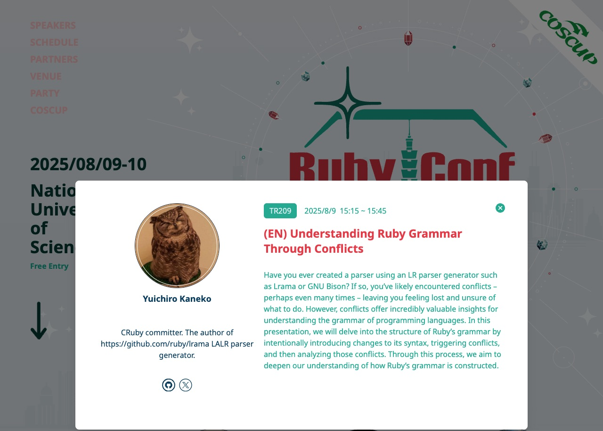

<!-- _class: lead scale-95 -->
<!-- _paginate: false -->
<!-- _header: "" -->

<style scoped>
h1 { font-size: 4em; padding: 0 0; margin: 0.25em 0;}
h2 { font-size: 2.5em;  padding: 0 0; margin: 0.25em 0;}
</style>

# コードのように台湾語を解析
## Rubyによる白話字ローマ字の3段階解析

**鄧慕凡 (Mu-Fan Teng)**

### RubyWorld Conference 2025

#### 島根県立産業交流会館「くにびきメッセ」Nov. 7, 2025

<!--
Speaker Note:
みなさん、こんにちは。
今日(きょう)は「コードのように台湾語(たいわんご)を解析(かいせき)」について話(はな)します。
-->

---

<!-- _class: center scale-95 -->

# 自己紹介

**鄧慕凡 (Mu-Fan Teng)**
- 日本では竜堂 終と呼ばれています
- 5xRuby CO., LTD 創業者
- 台湾のRuby伝道師
- RubyConf Taiwan Chief Organizer
- 三度目のRubyWorld登壇（2015, 2023, 2025）


<!--
Speaker Note:
まず自己紹介(じこしょうかい)です。

私(わたし)は台湾(たいわん)の5xRubyの創業者(そうぎょうしゃ)です。
2008年(ねん)からRubyコミュニティで活動(かつどう)しています。
RubyConf Taiwanを主催(しゅさい)しています。

-->

---

<!-- _class: scale-75 -->

# RubyCityMATSUE 縁結びの地との10年の物語

<div style="width: 90%; margin: 1.5em auto;">

<div style="display: grid; grid-template-columns: 1fr 1fr 1fr 1fr; gap: 0.5em; margin-bottom: 1em;">

  <div style="display: flex; flex-direction: column; align-items: center; justify-content: flex-end;">
    <div style="background: linear-gradient(135deg, #fff 0%, #fafafa 100%); padding: 0.6em; border-radius: 8px; border: 2px solid #CC342D; box-shadow: 0 2px 8px rgba(0,0,0,0.1);">
      <div style="color: #CC342D; font-weight: bold; margin-bottom: 0.3em; font-size: 0.8em;">🌸 縁の始まり</div>
      <ul style="font-size: 0.65em; line-height: 1.2; margin: 0; padding-left: 2em; text-align: left;">
        <li>初めてRWCの講者として登壇</li>
        <li>RubyCity Matsueとの出会い</li>
      </ul>
    </div>
    <div style="margin: 1em 0; font-size: 1.1em; font-weight: bold; color: #CC342D;">2015</div>
    <div style="width: 3px; height: 1em; background: #CC342D;"></div>
  </div>

  <div style="display: flex; flex-direction: column; align-items: center; justify-content: flex-end;">
    
  </div>

  <div style="display: flex; flex-direction: column; align-items: center; justify-content: flex-end;">
    <div style="background: linear-gradient(135deg, #fff 0%, #fafafa 100%); padding: 0.6em; border-radius: 8px; border: 2px solid #CC342D; box-shadow: 0 2px 8px rgba(0,0,0,0.1);">
      <div style="color: #CC342D; font-weight: bold; margin-bottom: 0.3em; font-size: 0.8em;">🤝 縁の深化</div>
      <ul style="font-size: 0.65em; line-height: 1.2; margin: 0; padding-left: 2em; text-align: left;">
        <li>上定市長の5xRuby訪問</li>
        <li>RubyCityとの絆が深まる</li>
      </ul>
    </div>
    <div style="margin: 1em 0; font-size: 1.1em; font-weight: bold; color: #CC342D;">2024</div>
    <div style="width: 3px; height: 1em; background: #CC342D;"></div>
  </div>

  <div style="display: flex; flex-direction: column; align-items: center; justify-content: flex-end;">
    
  </div>

</div>

<div style="position: relative; height: 8px; background: #CC342D; border-radius: 4px; margin: 0;">

  <div style="position: absolute; left: 12.5%; top: 50%; transform: translate(-50%, -50%);">
    <div style="width: 20px; height: 20px; background: #CC342D; border: 4px solid white; border-radius: 50%; box-shadow: 0 0 0 2px #CC342D; position: relative; z-index: 10;"></div>
  </div>

  <div style="position: absolute; left: 37.5%; top: 50%; transform: translate(-50%, -50%);">
    <div style="width: 20px; height: 20px; background: #CC342D; border: 4px solid white; border-radius: 50%; box-shadow: 0 0 0 2px #CC342D; position: relative; z-index: 10;"></div>
  </div>

  <div style="position: absolute; left: 62.5%; top: 50%; transform: translate(-50%, -50%);">
    <div style="width: 20px; height: 20px; background: #CC342D; border: 4px solid white; border-radius: 50%; box-shadow: 0 0 0 2px #CC342D; position: relative; z-index: 10;"></div>
  </div>

  <div style="position: absolute; left: 87.5%; top: 50%; transform: translate(-50%, -50%);">
    <div style="width: 20px; height: 20px; background: #CC342D; border: 4px solid white; border-radius: 50%; box-shadow: 0 0 0 2px #CC342D; position: relative; z-index: 10;"></div>
  </div>

</div>

<div style="display: grid; grid-template-columns: 1fr 1fr 1fr 1fr; gap: 0.5em; margin-top: 1em;">

  <div style="display: flex; flex-direction: column; align-items: center; justify-content: flex-start;">
    <div style="width: 0px; height: 1em; background: #CC342D; margin-bottom: 1em;"></div>
    
  </div>

  <div style="display: flex; flex-direction: column; align-items: center; justify-content: flex-start;">
    <div style="width: 3px; height: 1em; background: #CC342D;"></div>
    <div style="margin: 1em 0; font-size: 1.1em; font-weight: bold; color: #CC342D;">2023</div>
    <div style="background: linear-gradient(135deg, #fff 0%, #fafafa 100%); padding: 0.6em; border-radius: 8px; border: 2px solid #CC342D; box-shadow: 0 2px 8px rgba(0,0,0,0.1);">
      <div style="color: #CC342D; font-weight: bold; margin-bottom: 0.3em; font-size: 0.8em;">💝 縁結びの実現</div>
      <ul style="font-size: 0.65em; line-height: 1.2; margin: 0; padding-left: 2em; text-align: left;">
        <li>RubyCityからの協携提案</li>
        <li>市長と市役所で会談</li>
        <li>再びRWCの壇上へ</li>
      </ul>
    </div>
  </div>

  <div style="display: flex; flex-direction: column; align-items: center; justify-content: flex-start;">
    <div style="width: 0px; height: 1em; background: #CC342D; margin-bottom: 1em;"></div>
    
  </div>

  <div style="display: flex; flex-direction: column; align-items: center; justify-content: flex-start;">
    <div style="width: 3px; height: 1em; background: #CC342D;"></div>
    <div style="margin: 1em 0; font-size: 1.1em; font-weight: bold; color: #CC342D;">2025</div>
    <div style="background: linear-gradient(135deg, #fff 0%, #fafafa 100%); padding: 0.6em; border-radius: 8px; border: 2px solid #CC342D; box-shadow: 0 2px 8px rgba(0,0,0,0.1);">
      <div style="color: #CC342D; font-weight: bold; margin-bottom: 0.3em; font-size: 0.8em;">💍 縁結びの証</div>
      <ul style="font-size: 0.65em; line-height: 1.2; margin: 0; padding-left: 2em; text-align: left;">
        <li>RubyConf Taiwan × COSCUP 2025 <BR/>で覚書締結</li>
        <li>RubyCityとの正式な絆</li>
      </ul>
    </div>
  </div>

</div>

</div>

<!--
Speaker Note:
私(わたし)と RubyCity Matsue の縁(えん)について話(はな)します。

2015年(ねん)、初(はじ)めて RubyWorld Conference に来(き)ました。
RubyCity Matsue で話(はな)せて、とても嬉(うれ)しかったです。

2023年(ねん)、再(ふたた)び RWC に来(き)ました。
RubyCity Matsue から協力(きょうりょく)の提案(ていあん)がありました。
上定市長(かみさだしちょう)と市役所(しやくしょ)で会談(かいだん)しました。

2024年(ねん)2月(がつ)2日(にち)、市長(しちょう)が台北(たいぺい)の 5xRuby を訪問(ほうもん)しました。
技術(ぎじゅつ)と文化(ぶんか)を超(こ)えた交流(こうりゅう)でした。

2025年(ねん)8月(がつ)9日(にち)、RubyConf Taiwan で正式(せいしき)に覚書(おぼえがき)を締結(ていけつ)しました。

今日(きょう)、また RubyCity Matsue に戻(もど)って来(こ)れて嬉(うれ)しいです。
-->

---

<!-- _class: center -->

# 5xRubyについて

**「愛する技術で愛される製品を創る」**

- **創業**: 2014年（台北）
- **専門**: Ruby/Railsを中心としたソフトウェア開発
- **実績**: スタートアップ向けシステム開発を中心に、政府機関との協業案件も手がける

<!--
Speaker Note:
5xRuby は 2014年(ねん)に台北(たいぺい)で創業(そうぎょう)しました。
「愛(あい)する技術(ぎじゅつ)で愛(あい)される製品(せいひん)を創(つく)る」がビジョンです。

Ruby を中心(ちゅうしん)に、スタートアップのシステム開発(かいはつ)をしています。
政府機関(せいふきかん)の案件(あんけん)は他社(たしゃ)と協業(きょうぎょう)が多(おお)いですが、
今回(こんかい)の台湾語(たいわんご)プロジェクトは直接入札(ちょくせつにゅうさつ)しました。
-->

---

<!-- _class: scale-85 -->

# 5xRubyの事業

<div class="two-columns">

<div>

<div style="text-align: center;">


</div>

## 1. 委託開発サービス
- **台湾最大級のRuby開発会社**（2014年創業）
- クラウド・オンプレミス両対応のインフラ運用
- 日本・米国・シンガポールを含む国際展開
- スタートアップから上場企業まで長期パートナーシップ
- https://5xruby.com/en

</div>

<div>

<div style="text-align: center;">


</div>

## 2. SOSI製品
- セキュアリモートアクセス管理システム
- 踏み台サーバー（Bastion）機能
- ブラウザベース VDI ソリューション
- https://www.sosi.com.tw

</div>

</div>

<!--
Speaker Note:
2つの事業(じぎょう)があります。

1つ目(め)は委託開発(いたくかいはつ)です。
台湾最大級(たいわんさいだいきゅう)の Ruby 開発会社(かいはつがいしゃ)です。
クラウドとオンプレミス両方(りょうほう)できます。

日本(にほん)、アメリカ、シンガポールにもクライアントがいます。

2つ目(め)は自社製品(じしゃせいひん) SOSI です。
セキュアなリモートアクセスシステムです。
Bastion サーバーとして使(つか)われています。
-->

---

<!-- _class: scale-90 -->

# アジェンダ

<div class="two-columns">

<div>

## 本日の内容

1. **無人入札の物語**
   - なぜ誰も手を出さなかったのか？

2. **台羅（POJ）とは？**
   - 台湾語のローマ字表記

3. **分詞アライメント処理の実装**
   - GSUB による実装

4. **Parser との出会い**
   - Parslet による再実装

5. **Ruby の強み**
   - 結論とまとめ

</div>

<div style="text-align: center;">

### スライド資料

#### https://rwc2025.ryudo.tw


</div>

</div>

<!--
Speaker Note:
今日(きょう)の内容(ないよう)を紹介(しょうかい)します。

まず、無人入札(むにんにゅうさつ)の話(はなし)。
次(つぎ)に、POJ について。
そして、分詞(ぶんし)アライメントの実装(じっそう)。
その後(あと)、Parser との出会(であ)い。
最後(さいご)に、Ruby の強(つよ)み。

右(みぎ)の QR コードからスライドにアクセスできます。
-->

---

<!-- _class: lead -->

# 無人入札の物語

**なぜ誰も手を出さなかったのか？**

<!--
Speaker Note:
では本題(ほんだい)です。
このプロジェクトがどう始(はじ)まったか、話(はな)します。
-->

---

<!-- _class: scale-95 -->

# 台湾政府案件の特殊性

<div class="three-columns">

<div>

<div style="text-align: center;">


</div>

### 技術の制約
- Microsoft製品への依存
- .NET/MS-SQL/Windows Server
- Ruby/Railsは落選しがち

</div>

<div>

<div style="text-align: center;">


</div>

### プロセスの問題
- RFP（要求仕様書）の不備
- 担当者の専門知識不足
- 実務との乖離

</div>

<div>

<div style="text-align: center;">


</div>

### 隠れたコスト
- 膨大な文書作成業務
- セキュリティ監査・脆弱性診断
- 現地対応が必須の運用作業

</div>

</div>

<!--
Speaker Note:
台湾(たいわん)の政府案件(せいふあんけん)は難(むずか)しいです。

まず、Microsoft 製品(せいひん)に依存(いぞん)しています。
Ruby を使(つか)うと落選(らくせん)しやすいです。

次(つぎ)に、RFP が不十分(ふじゅうぶん)です。
評価委員(ひょうかいいん)に技術知識(ぎじゅつちしき)がないこともあります。

最後(さいご)に、隠(かく)れたコストがあります。
文書作成(ぶんしょさくせい)、セキュリティ監査(かんさ)、現地対応(げんちたいおう)。
開発以外(かいはついがい)の作業(さぎょう)が多(おお)いです。

私(わたし)たちは何度(なんど)も挑戦(ちょうせん)しました。
-->

---

<!-- _class: scale-90 -->

# 8連敗からの学び

<div class="two-columns">

<div>

<div style="text-align: center;">


</div>

## 落選の理由（技術以外）
- Microsoft製品前提の仕様
- 既存システムとの「互換性要求」
- 評価基準の不透明さ
- 価格競争ではなく、技術スタックの制約

</div>

<div>

<div style="text-align: center;">


</div>

## 9回目：驚きの展開
- **競合：ゼロ**
- 「なぜ誰も入札しないのか？」
- 担当者も困惑：「本当に大丈夫ですか？」
- **一体何が起こったのか？**

</div>

</div>

<!--
Speaker Note:
2023年(ねん)から、8回(かい)連続(れんぞく)で落選(らくせん)しました。
理由(りゆう)は価格(かかく)ではありません。
Microsoft 製品前提(せいひんぜんてい)の仕様(しよう)でした。

9回目(きゅうかいめ)、驚(おどろ)きました。
競合(きょうごう)ゼロ。
誰(だれ)も入札(にゅうさつ)しませんでした。

担当者(たんとうしゃ)も困惑(こんわく)しました。
「本当(ほんとう)に大丈夫(だいじょうぶ)ですか？」と聞(き)かれました。

理由(りゆう)は落札後(らくさつご)に分(わ)かりました。
-->

---

<!-- _class: center highlight -->

# 落札後の真相

**「分詞（文字分割）が煩雑すぎて**
**誰も手を出さない」**

<!--
Speaker Note:
落札(らくさつ)してから、理由(りゆう)が分(わ)かりました。
台湾語(たいわんご)の分詞処理(ぶんししょり)。
とても複雑(ふくざつ)です。

他(ほか)の会社(かいしゃ)は知(し)っていました。
だから誰(だれ)も入札(にゅうさつ)しませんでした。

私(わたし)たちは知(し)りませんでした。
無知(むち)が勇気(ゆうき)でした。

でも、Ruby で解決(かいけつ)できました。
-->

---

<!-- _class: lead -->

# 台羅（POJ）とは？

**日本語との類似性から理解する**

<!--
Speaker Note:
何(なに)が難(むずか)しいのか？
台湾語(たいわんご)の文字(もじ)システムを説明(せつめい)します。
日本語(にほんご)と比較(ひかく)します。
-->

---

<!-- _class: scale-85 -->

# 台羅（台湾閩南語ローマ字）とは？

| 前後文脈（漢字） | 前後文脈（POJ） |
|------------------|------------------|
| 去**日本**食壽司 | khì **Ji̍t-pún** tsia̍h sú-sih |
| 香港、澳門...、臺灣佮**日本** | Hiong-káng, Ò-mn̂g...Tâi-uân kah **Ji̍t-pún** |
| 的時，**日本**義工共臺灣人 | ê sî, **Ji̍t-pún** gī-kang kā Tâi-uân-lâng |

<div class="two-columns">

<div>

## 台湾語のローマ字表記
- **正式名称**: 臺灣台語羅馬字拼音方案
- **略称**: 台羅 (Tâi-lô)
- **制定**: 2006年10月、台湾教育部公布
- **地位**: 台湾語の公式表記システム

</div>

<div>

## 中国語（北京語）ではない
- **台湾語**: 閩南語系の言語
- **特徴**:
  - 9つの声調
  - 独自の子音・母音体系
  - 鼻音化の表記 (nn)
- **歴史**: 白話字 (POJ) をベースに IPA 要素を取り入れて開発

</div>

</div>

<!--
Speaker Note:
台羅(たいら)は 2006年(ねん)に台湾教育部(たいわんきょういくぶ)が公布(こうふ)しました。
台湾語(たいわんご)の公式(こうしき)ローマ字(じ)です。

台湾語(たいわんご)は中国語(ちゅうごくご)と違(ちが)います。
9つの声調(せいちょう)があります。
独自(どくじ)の子音(しいん)・母音(ぼいん)システムです。

19世紀(せいき)の白話字(はくわじ) POJ がベースです。

表(ひょう)を見(み)てください。
「日本(にほん)」は必(かなら)ず「Ji̍t-pún」です。
日本語(にほんご)の振(ふ)り仮名(がな)に似(に)ています。
-->

---

<!-- _class: scale-80 -->

# 日本語と台湾語の文字システム

<div class="two-columns">

<div>

## 日本語
- **漢字** ↔ **ひらがな/カタカナ**
- 例：
  - 「生」→ せい/しょう/なま/い...
  - 「音読み」と「訓読み」
  - 文脈によって読み方が変わる

</div>

<div>

## 台湾語
- **漢字** ↔ **POJ（白話字）**
- 例：
  - 「夫」→ hu
  - 「膚」→ hu (同音異字)
- **共通点**: 同音異字が存在
- **相違点**: 本システムでは文章内で漢字とPOJの完全一致が必須

</div>

</div>

<!--
Speaker Note:
日本語(にほんご)は音読(おんよ)みと訓読(くんよ)みがあります。
「生(せい)」は、色々(いろいろ)な読(よ)み方(かた)があります。

台湾語(たいわんご)も同(おな)じです。
「夫(ふ)」も「膚(ふ)」も「hu」です。

でも、このシステムでは完全一致(かんぜんいっち)が必要(ひつよう)です。
漢字(かんじ)と POJ が一対一(いちたいいち)です。

これが複雑(ふくざつ)な理由(りゆう)です。
-->

---

<!-- _class: scale-80 -->

# 実際の分詞アライメント処理例

<div style="background: #f5f5f5; padding: 1.5em; border-radius: 8px; margin: 1em 0;">

**入力データ（分詞前）:**
- 漢字：`紲落來看新竹市明仔載二十六號的天氣`
- POJ：`suà-lo̍h lâi-khuànn Sin-tik-tshī bîn-á-tsài gī-tsap-lak hō ê thinn-khì`

**期待される出力（分詞アライメント処理後）:**

| 漢字 | POJ |
|------|--------|
| 紲落 | suà-lo̍h |
| 來看 | lâi-khuànn |
| 新竹市 | Sin-tik-tshī |
| 明仔載 | bîn-á-tsài |
| 二十六 | gī-tsap-lak |
| 號 | hō |
| 的 | ê |
| 天氣 | thinn-khì |

</div>

<!--
Speaker Note:
実際(じっさい)の例(れい)を見(み)ます。

上(うえ)は分詞前(ぶんしまえ)です。
下(した)が期待(きたい)される出力(しゅつりょく)です。

表(ひょう)を見(み)てください。
漢字(かんじ)と POJ が一行(いちぎょう)ずつ対応(たいおう)しています。

「紲落(すいらく)」と「suà-lo̍h」、
「來看(らいかん)」と「lâi-khuànn」、
「新竹市(しんちくし)」と「Sin-tik-tshī」。

すべての行(ぎょう)で正確(せいかく)に対応(たいおう)が必要(ひつよう)です。
-->

---

<!-- _class: lead -->

# 分詞アライメント処理の実装

**3つのPhaseによる処理フロー**

<!--
Speaker Note:
では、実装方法(じっそうほうほう)を見(み)せます。
3つの Phase で処理(しょり)を進(すす)めます。
-->

---

<!-- _class: center -->


# 実装の全体フロー：3つのPhase


<div style="text-align: center;">


</div>

<!--
Speaker Note:
実装(じっそう)は 3 つの Phase に分(わ)かれます。

Phase 1 は WASH、記号(きごう)の正規化(せいきか)。
Phase 2 は SPLIT、配列(はいれつ)への分割(ぶんかつ)。
Phase 3 は ALIGN、対齊(たいせい)と検証(けんしょう)。

今日(きょう)の例(れい)は、Edge Case です。
漢字(かんじ)の中(なか)に POJ 文字(もじ)が含(ふく)まれている例(れい)を使(つか)います。

範例(はんれい)データは画面(がめん)に表示(ひょうじ)されています。
漢字(かんじ)と POJ の両方(りょうほう)を見(み)てください。
-->

---

<!-- _class: scale-85 -->

# Phase 1-1: washed_kanji - 漢字の正規化

<div class="two-columns">

<div>

## 実装コード

```ruby
def washed_kanji
  kanji.then do |ks|
    KANJI_GSUB_PATTERNS.each do |mt, kp|
      ks = ks.gsub(mt, kp)
    end
    ks
  end
end

# KANJI_GSUB_PATTERNS（抜粋）
{
  /([^\.])\./ => '\1 .',
  /\.([^\.])/ => '. \1',
  /（([^（]+)/ => ' （ \1',
  /([^）]+)）/ => '\1 ） '
  # ... 他のパターン
}
```

</div>

<div>

## 処理説明

1. **KANJI_GSUB_PATTERNS を順次適用**
   - 記号の前後にスペース挿入
   - ピリオド、カンマなどを分離

2. **主な処理:**
   - `/([^\.])\./ => '\1 .'` - ピリオド前にスペース
   - `/\.([^\.])/ => '. \1'` - ピリオド後にスペース
   - `/（([^（]+)/ => ' （ \1'` - 全角括弧処理

3. **Edge Case 対応:**
   - POJ 文字（Lín--sàng）も適切に処理

## 実行例

**入力:** `做工課的Lín--sàng。`
**出力:** `做工課的Lín--sàng 。`

</div>

</div>

<!--
Speaker Note:
Phase 1-1 では、漢字(かんじ)テキストの正規化(せいきか)を行(おこな)います。

washed_kanji メソッドは、
KANJI_GSUB_PATTERNS を順番(じゅんばん)に適用(てきよう)します。

主(おも)な処理(しょり)は、記号(きごう)の前後(ぜんご)にスペースを挿入(そうにゅう)することです。

この例(れい)では、句点(くてん)「。」の前(まえ)にスペースが挿入(そうにゅう)されます。

Edge Case として、漢字(かんじ)の中(なか)の POJ 文字(もじ)も正(ただ)しく処理(しょり)されます。
-->

---

<!-- _class: scale-85 -->

# Phase 1-2: washed_roman - POJの正規化

<div class="two-columns">

<div>

## 実装コード

```ruby
def washed_roman
  roman.then do |rs|
    ROMAN_GSUB_PATTERNS.each do |mt, rp|
      rs = rs.gsub(mt, rp)
    end
    rs
  end
end

# ROMAN_GSUB_PATTERNS（抜粋）
{
  /(.)(\.)(.)/ => '\1 \2 \3',  # ピリオド分離
  # ハイフンは保持（重要！）
  # 二重ハイフン（--）も保持
  # ... 65+ パターン
}
```

</div>

<div>

## 処理説明

1. **65+ パターンで正規化**
   - 記号の前後にスペース挿入
   - カンマ、ピリオド、引用符などを分離

2. **重要なポイント:**
   - ✅ **ハイフンは保持** - 音節区切りとして必須
   - ✅ **二重ハイフン（--）も保持** - 語間停頓

3. **記号処理:**
   - `/(.)(\.)(.)/ => '\1 \2 \3'` - ピリオド分離

## 実行例

**入力:** `tsò-khang-khuè ê Lín--sàng.`
**出力:** `tsò-khang-khuè ê Lín--sàng .`

</div>

</div>

<!--
Speaker Note:
Phase 1-2 では、POJ テキストの正規化(せいきか)を行(おこな)います。

washed_roman メソッドは、
ROMAN_GSUB_PATTERNS を順番(じゅんばん)に適用(てきよう)します。

65 個以上(こいじょう)のパターンがありますが、
最(もっと)も重要(じゅうよう)なのは、ハイフンを保持(ほじ)することです。

ハイフンは音節(おんせつ)の区切(くぎ)りを示(しめ)します。
二重(にじゅう)ハイフン（--）は語間停頓(ごかんていとん)を示(しめ)します。

この例(れい)では、ピリオドの前後(ぜんご)にスペースが挿入(そうにゅう)されます。
-->

---

<!-- _class: scale-80 -->

# Phase 2-1: splitted_kanji - 漢字の分割

<div class="two-columns">

<div>

## 実装コード

```ruby
def splitted_kanji
  combine_one_word(
    washed_kanji.scan(RXP_SPK).map do |spka|
      spka.split(/\s/)
    end.flatten.join(' ')
  ).split
end

# RXP_SPK - CJK文字と非CJK文字を識別
RXP_SPK = /[\p{Han}\p{Katakana}\p{Hiragana}
  \p{Hangul}\u3000-\u303F\uFF00-\uFFEF]|
  [^\p{Han}\p{Katakana}\p{Hiragana}
  \p{Hangul}\u3000-\u303F\uFF00-\uFFEF]+/x

# combine_one_word - 特殊組合せ処理
def combine_one_word(text)
  text.then do |ks|
    ONE_KANJI_WORDS.each { |mt, kp|
      ks = ks.gsub(mt, kp)
    }
    ks
  end
end
```

</div>

<div>

## 処理説明

1. **RXP_SPK で文字スキャン**
   - CJK 文字（漢字、ひらがな等）
   - 非CJK 文字（POJ、数字等）
   - 一文字ずつ or 連続した非CJK文字をまとめて認識

2. **combine_one_word で特殊処理**
   - ONE_KANJI_WORDS パターン適用
   - 特定の記号組合せを結合

3. **スペースで分割**

4. **Edge Case の処理:**
   - `Lín--sàng` が1つの token として認識される

## 実行例

**入力:** `做工課的Lín--sàng 。`
**出力:**
`["做", "工", "課", "的", "Lín--sàng", "。"]`

</div>

</div>

<!--
Speaker Note:
Phase 2-1 では、漢字(かんじ)テキストを配列(はいれつ)に分割(ぶんかつ)します。

splitted_kanji メソッドは、3つのステップで処理(しょり)します。

まず、RXP_SPK Regular Expressionで文字(もじ)をスキャンします。
このRegular Expressionは、CJK 文字(もじ)と非(ひ) CJK 文字(もじ)を区別(くべつ)します。

次(つぎ)に、combine_one_word で特殊(とくしゅ)な組(く)み合(あ)わせを処理(しょり)します。

最後(さいご)に、スペースで分割(ぶんかつ)します。

この例(れい)では、POJ 文字(もじ)部分(ぶぶん)が 1 つの token として認識(にんしき)されます。
これが Edge Case の処理(しょり)です。
-->

---

<!-- _class: scale-85 -->

# Phase 2-2: splitted_roman - POJの分割

<div class="two-columns">

<div>

## 実装コード

```ruby
def splitted_roman
  washed_roman
    .split(/\s/)
    .compact_blank
end
```

**シンプル！わずか3行**

</div>

<div>

## 処理説明

1. **シンプル：スペースで分割**
   - Phase 1 で記号が既に分離済み
   - スペースのみで分割可能

2. **重要な設計:**
   - ✅ **ハイフンでは分割しない**
   - ✅ **二重ハイフン（--）も保持**
   - 単語内の音節構造を維持

3. **compact_blank で空白要素削除**

## 実行例

**入力:** `tsò-khang-khuè ê Lín--sàng .`
**出力:**
`["tsò-khang-khuè", "ê", "Lín--sàng", "."]`

**音節数:**
- `tsò-khang-khuè` = 3音節
- `Lín--sàng` = 2音節（--は音節数に含まれない）

</div>

</div>

<!--
Speaker Note:
Phase 2-2 では、POJ テキストを配列(はいれつ)に分割(ぶんかつ)します。

splitted_roman メソッドは、非常(ひじょう)にシンプルです。
わずか 3 行(ぎょう)です。

Phase 1 で既(すで)に記号(きごう)が分離(ぶんり)されているので、
スペースで分割(ぶんかつ)するだけです。

重要(じゅうよう)な設計(せっけい)は、ハイフンでは分割(ぶんかつ)しないことです。
単語内(たんごない)の音節構造(おんせつこうぞう)を維持(いじ)します。

音節数(おんせつすう)の計算(けいさん)について説明(せつめい)します。
最初(さいしょ)の単語(たんご)は 3 音節(おんせつ)です。
Edge Case の部分(ぶぶん)は 2 音節(おんせつ)です。
二重(にじゅう)ハイフン（--）は音節数(おんせつすう)に含(ふく)まれません。
-->

---

<!-- _class: scale-75 -->

# Phase 3: 対齊と検証

<div class="two-columns">

<div>

```ruby
def roman_kanji_array
  spk = splitted_kanji.dup
  splitted_roman.map do |rword|
    if rword == '--' || (SP_MIRRORS.key?(rword) &&
        #... Edge Case の処理
        [rword, spss]
      end
    end
  end
end

def set_arrays
  rka = roman_kanji_array.transpose
  assign_attributes(
    roman_array: rka[0],
    kanji_array: rka[1]
  )
  self.arrays_balanced = [
    roman_array.size.positive?,
    roman_array.size == kanji_array.size,
    kanji_array.join.size ==
      washed_kanji.delete(' ').size
  ].all?
end
```

</div>

<div>

## 処理説明

1. **音節数でマッチング**
   - ハイフン = 音節区切り
   - `tsò-khang-khuè` (3音節) → 漢字3文字
   - `Lín--sàng` (2音節) → Roman そのまま

2. **Edge Case の処理:**
   - Roman が kanji 側にある場合、そのまま対応
   - 二重ハイフン（--）は音節数に含まれない

3. **配列の組み合わせ**：`transpose` で roman/kanji を分離

4. **平衡性検証（3条件）**
   - ✅ 配列が空でない
   - ✅ roman と kanji の要素数が一致
   - ✅ kanji の総文字数が元の文字数と一致

|                           |                                                                                     |
| ------------------------- | ----------------------------------------------------------------------------------- |
| **kanji_array:**      | `["做工課", "的", "Lín--sàng", "。"]`                                                  |
| **roman_array:**      | `["tsò-khang-khuè", "ê", "Lín--sàng", "."]`                                       |
| **roman_kanji_array** | `[["tsò-khang-khuè", "做工課"], ["ê", "的"], ["Lín--sàng", "Lín--sàng"], [".", "。"]]` |


</div>

</div>

<!--
Speaker Note:
Phase 3 では、対齊(たいせい)と検証(けんしょう)を行(おこな)います。

roman_kanji_array メソッドは、
音節数(おんせつすう)に基(もと)づいてマッチングします。

最初(さいしょ)の単語(たんご)は 3 音節(おんせつ)なので、
漢字(かんじ) 3 文字(もじ)に対応(たいおう)します。

Edge Case の部分(ぶぶん)は特別(とくべつ)です。
これは kanji 側(がわ)に Roman として存在(そんざい)するので、
そのまま対応(たいおう)します。

set_arrays メソッドは、
transpose で roman と kanji を分離(ぶんり)し、
平衡性(へいこうせい)を検証(けんしょう)します。

3つの条件(じょうけん)をすべて満(み)たせば、
この分詞(ぶんし)は正(ただ)しいと確定(かくてい)されます。
-->

---

<!-- _class: lead -->

# Parserとの出会い

**2024年の実装から2025年の気づきへ**

<!--
Speaker Note:
2024年初頭(しょとう)、分詞(ぶんし)システムを完成(かんせい)させました。

そして2025年(ねん)、思(おも)わぬ気(き)づきがありました。-->

---

<!-- _class: scale-90 -->

# 金子さんのトークからの気づき

<div style="display: grid; grid-template-columns: 1.2fr 1fr; gap: 2em; align-items: center;">

<div>



</div>

<div>

**"Understanding Ruby Grammar Through Conflicts"**

<div style="margin: 1.5em 0; padding: 1em; background: #f5f5f5; border-left: 4px solid #CC342D; border-radius: 4px;">

**Parser の3段階処理**

1. **Lexical Analysis** (字句解析)
2. **Syntax Analysis** (構文解析)
3. **Semantic Analysis** (意味解析)

</div>

<div style="margin-top: 2em; padding: 1em; background: linear-gradient(135deg, #fff3cd 0%, #fff 100%); border-radius: 8px;">

<div style="text-align: center; font-size: 1.1em; margin-bottom: 0.8em;">
💡 **「私がやっていたのは... Parser だったのか！」**
</div>

<div style="text-align: center; font-size: 1.05em; margin-top: 1em; padding-top: 1em; border-top: 2px dashed #CC342D;">
→ **「Parser として実装し直してみよう」**
</div>

</div>

</div>

</div>

<!--
Speaker Note:
近年(きんねん)、Ruby Parser の発展(はってん)により、Syntax Parser に関(かん)する演講(えんこう)に触(ふ)れる機会(きかい)がありました。

今年(ことし)の RubyConf Taiwan で、金子(かねこ)さんの「Understanding Ruby Grammar Through Conflicts」を聞(き)いた後(あと)、
気(き)づきました。

私(わたし)が NAER プロジェクトで実装(じっそう)した分詞処理(ぶんししょり)も、
3 段階処理(だんかいしょり)を持(も)つ Parser の一種(いっしゅ)なのではないか？

そこで、この Parser として書(か)き直(なお)すプロセスを通(つう)じて、
テーマを共有(きょうゆう)したいと思(おも)いました。-->

---

<!-- _class: center highlight -->

# Conference Driven Development

**Parser の方式で分詞アライメント処理を実装する**

<!--
Speaker Note:
これも一種(いっしゅ)の Conference Driven Development だと思(おも)います。

本来(ほんらい)、私(わたし)はこれを書(か)き直(なお)すつもりはありませんでした。

しかし、他(ほか)の人(ひと)の講演(こうえん)に触発(しょくはつ)されて、
この可能性(かのうせい)に気(き)づき、
今回(こんかい)の講演(こうえん)と研究(けんきゅう)が生(う)まれました。-->

---

<!-- _class: scale-85 -->

# Parslet gem との出会い

**Ruby で Parser を書くための DSL ライブラリ**

<div class="two-columns">

<div>

## なぜ Parslet？

- **PEG Parser**: Parsing Expression Grammar
- **Ruby DSL**: Ruby の文法で Parser を定義
- **明確な構造**: 3-phase 設計を自然に実現

```ruby
# Parslet の基本形
class MyParser < Parslet::Parser
  # Phase 1 & 2: 規則定義
  rule(:word) { match['a-z'].repeat(1) }
  rule(:sentence) { word >> space }

  root(:sentence)
end
```

</div>

<div>

## Parslet の設計思想

Parslet は開発者に **3つの Phase** を意識させる設計：

**Phase 1: Lexical Analysis**
- `rule()` で Token 型を定義
- `match[]`, `str()` で文字パターン

**Phase 2: Syntax Analysis**
- `>>`, `|` で規則を組み合わせ
- 自動的に AST を構築

**Phase 3: Semantic Analysis**
- `Transform` クラスで変換
- AST → 最終データ構造

</div>

</div>

<!--
Speaker Note:
Parser として実装してみようと思ったとき、
Ruby で Parser を書くための Gem を探しました。

そこで見つけたのが、Parslet です。

Parslet は、PEG Parser を Ruby の DSL で書けるライブラリです。

重要なのは、Parslet の設計思想です。

Parslet は、開発者に自然と 3 つの Phase を意識させる設計になっています。

Lexical Analysis、Syntax Analysis、Semantic Analysis。

この構造が、まさに私が学んだ Parser の 3 段階処理と一致していました。-->

---

<!-- _class: scale-75 -->

# Parslet DSL 基礎語法

<div class="three-columns">

<div>

## 基本構文

### `rule()` - 規則の定義

```ruby
rule(:letter) { match['a-zA-Z'] }
rule(:digit) { match['0-9'] }
```

**意味**: 再利用可能な Parser 規則を定義

### `match[]` - 文字クラス

```ruby
match['a-z']           # a-z
match['a-zA-Z0-9']     # 英数字
match['\u0300-\u036F'] # 声調記号
```

**意味**: Regular Expressionの `[...]` と同じ

### `str()` - 文字列マッチ

```ruby
str('-')      # ハイフン
str('--')     # 二重ハイフン
str(' - ')    # スペース-ハイフン-スペース
```

**意味**: 文字列の完全一致

</div>

<div>

## 組み合わせ

### `>>` - シーケンス

```ruby
# A の後に B が続く
rule(:word) { letter >> letter }
```

**意味**: 順序を持つ連結（AND）

### `|` - 選択

```ruby
# A または B（順序が重要！）
rule(:token) do
  double_hyphen_word |  # 先に試す
  hyphenated_word       # 後で試す
end
```

**重要**: PEG は最初にマッチした選択肢を採用

### `.repeat` - 繰り返し

```ruby
match['a-z'].repeat      # 0回以上
match['a-z'].repeat(1)   # 1回以上
```

</div>

<div>

## AST 構築

### `.as(:symbol)` - 命名

```ruby
# Token に型を付ける
rule(:word) {
  letter.repeat(1).as(:word)
}

# 出力される AST
{ word: "hello" }
```

**意味**: AST で識別するための名前

### `root()` - 開始規則

```ruby
# Parser の入口を指定
rule(:sentence) {
  token >> space?
}
root(:sentence)
```

**意味**: どの規則から解析を始めるか指定

</div>

</div>

<!--
Speaker Note:
Parslet の基本(きほん)を見(み)ていきましょう。

画面(がめん)左側(ひだりがわ)は、基本構文(きほんこうぶん)です。
rule で規則(きそく)を定義(ていぎ)します。
文字(もじ)の範囲(はんい)や文字列(もじれつ)のマッチを記述(きじゅつ)します。

中央(ちゅうおう)は、組(く)み合(あ)わせ方法(ほうほう)です。
連続(れんぞく)したパターンや、いずれか一方(いっぽう)を選択(せんたく)するパターンを定義(ていぎ)できます。
重要(じゅうよう)なのは、順序(じゅんじょ)です。
PEG では、最初(さいしょ)にマッチしたパターンが採用(さいよう)されます。

右側(みぎがわ)は、AST 構築(こうちく)です。
マッチした部分(ぶぶん)に名前(なまえ)を付(つ)けて、
構造化(こうぞうか)されたデータとして出力(しゅつりょく)します。

これらを組(く)み合(あ)わせることで、
複雑(ふくざつ)な言語(げんご)パターンを Parser として実装(じっそう)できます。-->

---

<!-- _class: scale-60 -->

# Regexp → Parslet への変換（GSUB パターンから Parser 規則へ）

<div class="two-columns">

<div>

## 標点符号の処理

### GSUB 方式

```ruby
# 65+ パターンの一部
ROMAN_GSUB_PATTERNS = {
  /,/ => ' , ',      # カンマ前後に空白
  /\./ => ' . ',     # ピリオド前後に空白
  /!/ => ' ! ',      # 感嘆符前後に空白
  /\?/ => ' ? ',     # 疑問符前後に空白
  # ... 他 60+ パターン
}

# 適用
text = "suà-lo̍h,lâi-khuànn"
ROMAN_GSUB_PATTERNS.each do |pattern, replacement|
  text = text.gsub(pattern, replacement)
end
# => "suà-lo̍h , lâi-khuànn"
```

**特徴**: 記号を空白で囲む → 後で split

</div>

<div>

### Parslet 方式

```ruby
# 標点符号を Token として直接認識
rule(:punctuation) do
  str('...') | str('⋯⋯') | str('……') |  # 複数文字優先
  match[',.:;()!?？！/~、─…⋯'] |         # 単一文字
  match["\"'\u201C\u201D\u2018\u2019"] |  # 引用符 （ いんようふ ）
  match['\u3000-\u303F']                  # CJK記号
end

# Token 規則
rule(:token) do
  hyphenated_word.as(:word) |
  punctuation.as(:punct)
end
```

**入力**: `"suà-lo̍h,lâi-khuànn"`

**出力（AST）**:
```ruby
[
  { word: "suà-lo̍h" },
  { punct: "," },
  { word: "lâi-khuànn" }
]
```

**特徴**: Token として構造化 → split 不要

</div>

</div>

<!--
Speaker Note:
GSUB 方式(ほうしき)と Parslet 方式(ほうしき)を比較(ひかく)してみましょう。

左側(ひだりがわ)は、GSUB 方式(ほうしき)です。
65 個以上(こいじょう)のパターンで、
カンマやピリオドなどの記号(きごう)の前後(ぜんご)に空白(くうはく)を挿入(そうにゅう)します。

その後(あと)、スペースで分割(ぶんかつ)します。
2 ステップのアプローチです。

右側(みぎがわ)は、Parslet 方式(ほうしき)です。

記号(きごう)を Token として直接(ちょくせつ)認識(にんしき)します。
結果(けっか)は、構造化(こうぞうか)された AST として出力(しゅつりょく)されます。

単語(たんご)と記号(きごう)が明確(めいかく)に区別(くべつ)されています。

Parslet では、split が不要(ふよう)になります。
より構造化(こうぞうか)されたアプローチです。-->

---

<!-- _class: scale-65 -->

# Regexp → Parslet への変換（連字符処理と音節数による漢字対応）

<div class="two-columns">

<div>

## 連字符の保持（Page 17 & 18）

### GSUB 方式

```ruby
# Step 1: 記号正規化
text = "suà-lo̍h lâi-khuànn"
# ハイフンは保持（重要！）

# Step 2: スペース分割
tokens = text.split(/\s/)
# => ["suà-lo̍h", "lâi-khuànn"]

# Step 3: 音節数をカウント
syllables = "suà-lo̍h".split('-').size
# => 2

# Step 4: 漢字を音節数分取得
kanji_chars = ["紲", "落", "來", "看"]
combined = kanji_chars.shift(syllables).join
# => "紲落"
```

**原理**: ハイフン = 音節区切り

</div>

<div>

### Parslet 方式

```ruby
# 連字符付き単語を1つの Token として認識
rule(:hyphenated_word) do
  syllable >>
  (single_hyphen >> syllable).repeat
end

# "suà-lo̍h" → { word: "suà-lo̍h" }
```

**音節数の計算**:
```ruby
# Phase 3: Transform
rule(word: simple(:w)) do
  syllables = w.to_s.split('-').size
  # => 2
end
```

**漢字対応**:
```ruby
# 音節数 = 漢字文字数
"suà-lo̍h".split('-').size  # => 2
"紲落".chars.size            # => 2
# ✅ 一致！
```

**原理**: Parser が音節構造を保持 → 自動対応

</div>

</div>

<!--
Speaker Note:
次(つぎ)は、ハイフン処理(しょり)による音節数(おんせつすう)の計算(けいさん)です。

左側(ひだりがわ)は、GSUB 方式(ほうしき)です。

ハイフンを保持(ほじ)したまま分割(ぶんかつ)し、
ハイフンで音節数(おんせつすう)をカウントします。
音節数(おんせつすう)分の漢字(かんじ)を取得(しゅとく)します。

原理(げんり)は、「ハイフン = 音節(おんせつ)の区切(くぎ)り」。
そして、「1 音節(おんせつ) = 1 漢字(かんじ)」です。

右側(みぎがわ)は、Parslet 方式(ほうしき)です。

ハイフン付(つ)き単語(たんご)を 1 つの Token として認識(にんしき)します。
Parser が音節構造(おんせつこうぞう)を保持(ほじ)します。

Phase 3 で音節数(おんせつすう)を計算(けいさん)し、
対応(たいおう)する漢字(かんじ)を取得(しゅとく)します。

Parser が構造(こうぞう)を認識(にんしき)するので、
後(あと)の処理(しょり)が自動化(じどうか)されます。-->

---

<!-- _class: scale-80 -->

# Ruby Parser との比較

<div class="two-columns">

<div>

## Ruby Parser (Prism)

```ruby
# 入力
"def foo(x); x + 1; end"
```

**Phase 1: Lexical**
```
[DEF][IDENTIFIER][LPAREN][IDENTIFIER]
[RPAREN][SEMICOLON][IDENTIFIER][PLUS]
[INTEGER][SEMICOLON][END]
```

**Phase 2: Syntax**
```ruby
DefNode(
  name: :foo,
  parameters: ParametersNode(...),
  body: StatementsNode(...)
)
```

**Phase 3: Semantic**
- Type checking
- Scope analysis
- Code generation

</div>

<div>

## 台羅 Parser (RomanParserPure)

```
# 入力
"suà-lo̍h lâi-khuànn"
```

**Phase 1: Lexical**
```
[suà-lo̍h][lâi-khuànn]
```

**Phase 2: Syntax**
```ruby
{
  sentence: [
    { word: "suà-lo̍h" },
    { word: "lâi-khuànn" }
  ]
}
```

**Phase 3: Semantic**
- AST transformation
- Array generation
```ruby
["suà-lo̍h", "lâi-khuànn"]
```

**注**: 実験的実装（教育目的）

</div>

</div>

<!--
Speaker Note:
それでは、Ruby の Parser と比較してみましょう。

左側は Ruby の Prism Parser です。
右側は実験的に作った RomanParserPure です。

もちろん、Ruby Parser ほど複雑ではありません。
これは実験的な実装です。

しかし、両方とも同じ 3-phase の構造を持っています。

Parser の考え方は、プログラミング言語だけでなく、
自然言語の処理にも応用できる。

これが、この実験から学んだことです。-->

---

<!-- _class: scale-80 -->

# 漢字処理は POJ Parser に依存

**一方向の依存関係：複雑な構造を先に解析**

<div class="two-columns">

<div>

## POJ Parser（複雑）

```ruby
# RomanParserPure - Parslet で実装
roman_array = [
  "suà-lo̍h",      # 2音節
  "lâi-khuànn",    # 2音節
  "Sin-tik-tshī"   # 3音節
]

# 音節数の計算
"suà-lo̍h".split('-').size  # => 2
"Sin-tik-tshī".split('-').size  # => 3
```

**複雑な処理:**
- ✅ ハイフンの意味解析（音節 vs 語間）
- ✅ 声調記号の認識（Unicode 結合文字）
- ✅ 二重ハイフン（--）の特殊処理
- ✅ 構文規則の定義と AST 構築

</div>

<div>

## 漢字処理（シンプル）

```ruby
# POJ の音節数に従うだけ
kanji = "紲落來看新竹市"

# 1. "suà-lo̍h" = 2音節
#    → 漢字2文字: "紲落"
# 2. "lâi-khuànn" = 2音節
#    → 漢字2文字: "來看"
# 3. "Sin-tik-tshī" = 3音節
#    → 漢字3文字: "新竹市"

kanji_array = ["紲落", "來看", "新竹市"]
```

**シンプルな処理:**
- ✅ 音節数 = 文字数の対応
- ✅ パターンマッチング（Edge Case 用）
- ✅ 独立した構文解析は不要

</div>

</div>

<!--
Speaker Note:
重要(じゅうよう)なポイントは、一方向(いっぽうこう)の依存関係(いぞんかんけい)です。

POJ Parser が複雑(ふくざつ)な処理(しょり)をします。
ハイフンの意味解析(いみかいせき)、声調記号(せいちょうきごう)の認識(にんしき)、
構文規則(こうぶんきそく)の定義(ていぎ)。

一方(いっぽう)、漢字処理(かんじしょり)はシンプルです。
POJ の音節数(おんせつすう)に従(したが)って文字(もじ)を取得(しゅとく)するだけ。

これは、Compiler 理論(りろん)の重要(じゅうよう)な原理(げんり)です。
複雑(ふくざつ)な構造(こうぞう)を先(さき)に解析(かいせき)すれば、
シンプルな構造(こうぞう)は自然(しぜん)に対応(たいおう)付(づ)けできます。

Ruby Parser でも同(おな)じです。
複雑(ふくざつ)な構文(こうぶん)を先(さき)に解析(かいせき)すれば、
型推論(かたすいろん)などは後(あと)から自動的(じどうてき)に付(つ)いてきます。-->

---

<!-- _class: scale-80 -->

# RomanParserPure の実装を試してみよう

**GitHub で公開中：テストデータと検証スクリプト**

<div class="two-columns">

<div style="display: flex; flex-direction: column; align-items: center; justify-content: center;">


**https://github.com/ryudoawaru/rwc2025-slide**

**含まれているもの:**
- 完全な RomanParserPure 実装
- WASHING_PATTERNS (65+ rules)
- 3000 件の実際のコーパスデータ

</div>

<div>
<!-- _class: scale-75 -->
## 🧪 テスト結果

```bash
$ ruby test_parser.rb

================================================================================
Testing RomanParserPure with 3000 records
================================================================================
[██████████████████████████████████████████████████] 100.0% (3000/3000)

================================================================================
Final Results
================================================================================
Total records:    3000
Parse success:    3000 (100.0%)
Parse errors:     0 (0.0%)
================================================================================

🎉 PERFECT! 100% success rate achieved!
```

**重要なポイント:**
- ✅ **100% Parse 成功率 - 3000 件すべて正確に解析**
- ✅ **エラーなしで完全動作 - 実用性と理論の両立**

</div>

</div>

<!--
Speaker Note:
この RomanParserPure の実装を GitHub で公開しています。

リポジトリには、Parser の完全な実装、テストスクリプト、
そして 3,000 件の実際のコーパスデータが含まれています。

テスト結果は、3,000 件すべて正解。通過率 100% です。

ぜひ、GitHub から clone して、実際に試してみてください。-->

---

<!-- _class: lead -->

# プロジェクトの成果

**Rubyで実現した台湾語教育システム**

<!--
Speaker Note:
最後(あと)に、この技術(ぎじゅつ)を使(つか)って実(じつ)現したシステムと、
プロジェクトの成果(せいか)についてお話しします。-->

---

<!-- _class: scale-80 -->

# NAERプロジェクト：台湾語コーパスシステム

- **公開URL**: https://tggl.naer.edu.tw
- **委託元**: 教育部・国家教育研究院

<div style="text-align: center; margin: 1.5em 0;">


</div>

<!--
Speaker Note:
この技術を使って実現したシステムをご紹介します。

システムは https://tggl.naer.edu.tw で一般公開されています。

主要機能を見ていきましょう。-->

---

<!-- _class: scale-80 -->

# 主要機能 1: 語料検索（コーパス検索）

**漢字・POJ・音声ファイルの統合検索システム**

<div style="text-align: center; margin: 1.5em 0;">


</div>

**特徴:**
- 漢字と台羅（POJ）の同時表示
- 音声ファイルの再生機能
- 前後文脈の表示
- 高度な検索フィルタ

<!--
Speaker Note:
1つ目は語料検索です。

今日説明した分詞アライメント処理が活用されています。
漢字と台羅が正確に一対一対応しています。

音声ファイルの再生、前後文脈の表示、高度な検索フィルタ。
台湾語の学習者が実際の使用例を豊富に参照できます。-->

---

<!-- _class: scale-80 -->

# 主要機能 2: 教科書語彙

**台湾の教科書で使用される台湾語語彙のデータベース**

<div style="text-align: center; margin: 1.5em 0;">

<video controls width="720" autoplay loop muted>
  <source src="images/textbook_search.webm" type="video/webm">
</video>

</div>

<!--
Speaker Note:
2つ目は教科書語彙の検索です。

台湾の小中学校の教科書で使われる語彙をデータベース化しました。
教科書別、学年別に分類され、漢字、台羅、華語訳が併記されています。

教育現場での実用性を重視した設計です。-->

---

<!-- _class: scale-80 -->

# 主要機能 3: 語法点検索（文法ポイント検索）

**台湾語の重要な文法パターンと例文の検索**

<div style="text-align: center; margin: 1.5em 0;">

<video controls width="720" autoplay loop muted>
  <source src="images/grammar-search.webm" type="video/webm">
</video>

</div>

<!--
Speaker Note:
3つ目は語法点検索です。

台湾語の文法パターンを体系的にまとめたデータベースです。
例文は漢字、台羅、華語訳が並んで表示されます。

これら3つの機能の基盤となっているのが、
今日紹介した分詞アライメント処理技術です。-->

---

<!-- _class: center highlight -->

# 結論

**コンパイラ理論の普遍性**
- プログラミング言語の Parser → 自然言語の処理
- Ruby の 3-phase 分析 → 台湾語の分詞アライメント

**適切な道具を選び、原理を理解すれば、複雑な問題も解決できる**

<!--
Speaker Note:
最後に、この発表(はっぴょう)の結論をお伝えします。

今回(こんかい)の経験から学んだのは、コンパイラ理論の普遍性(せい)です。

プログラミング言語(げんご)を解析(かいせき)する Parser の考え方(かた)が、
自然言語の処理(しょり)にも応用(おうよう)できる。

Ruby の Parser が持つ 3-phase 分析アプローチが、
台湾語の分詞(ぶんし)アライメント処理(しょり)にも使(つか)える。

重要(じゅうよう)なのは、「適切(てきせつ)な道具を選び、原理を理解(りかい)する」ことです。

Ruby のRegular Expressionの表現力、
Method Chaining の可読性(せい)、
Rails のエコシステム。

これらの特性を理解(りかい)し、適切(てきせつ)に組み合わせることで、
一見複雑(ふくざつ)に見える問題(もんだい)も、シンプルに解決(かいけつ)できるのです。

そして、Kaigiの発表から学んだように、
既存の知識(ちしき)や理論を、新しい問題(もんだい)領域に応用(おうよう)する。
これが、エンジニアとして成長する道だと思(おも)います。-->

---

<!-- _class: scale-95 -->

# ご清聴ありがとうございました

<div class="three-columns">

<div style="text-align: center;">

## 📦 スライド & コード


**https://github.com/ryudoawaru/rwc2025-slide**

</div>

<div style="text-align: center;">

## 🏢 5xRuby


**https://5xruby.com**

</div>

<div style="text-align: center;">

## 🎪 ブース出展中


**ぜひお立ち寄りください！**

</div>

</div>

<!--
Speaker Note:
ご清聴ありがとうございました。

左側の QR コードから、今日の RomanParserPure の完全な実装と、
テストデータ、スライド資料にアクセスできます。

中央は 5xRuby の公式サイトです。

そして右側、今回 RubyWorld Conference では、
Ruby コミュニティのブースを出展しております。
ぜひお立ち寄りください。

松江市との MOU を通じて、日台の Ruby コミュニティの交流を深めていきたいと思っています。

ありがとうございました！-->

<script type="module">
  import mermaid from 'https://cdn.jsdelivr.net/npm/mermaid@10/dist/mermaid.esm.min.mjs';
  mermaid.initialize({ startOnLoad: true });
</script>